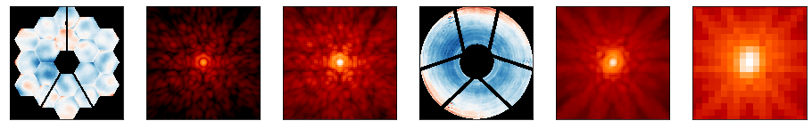

WebbPSF: Simulated Point Spread Functions for JWST and WFIRST
=============================================================

.. image:: https://img.shields.io/pypi/v/webbpsf.svg
   :target: https://pypi.python.org/pypi/webbpsf
   :alt: Badge showing current released PyPI version

.. image:: https://travis-ci.org/mperrin/webbpsf.svg?branch=master
   :target: https://travis-ci.org/mperrin/webbpsf
   :alt: Badge showing continuous integration test status

.. image:: https://coveralls.io/repos/github/mperrin/webbpsf/badge.svg?branch=master
   :target: https://coveralls.io/github/mperrin/webbpsf?branch=master

WebbPSF produces simulated PSFs for the James Webb Space Telescope, NASA's next
flagship infrared space telescope. WebbPSF can simulate images for any of the
four science instruments plus the fine guidance sensor, including both direct
imaging and coronagraphic modes.

WebbPSF also supports simulating PSFs for the proposed Wide-Field Instrument
for the upcoming WFIRST mission, including variation of the PSF within and
among the eighteen detectors.

Developed by Marshall Perrin, Joseph Long, and collaborators, 2010-2016.

Documentation can be found online at https://pythonhosted.org/webbpsf/

WebbPSF requires input data for its simulations, including optical path
difference (OPD) maps, filter transmission curves, and coronagraph Lyot mask
shapes. These data files are not included in this source distribution.
Please see the documentation to download the required data files.

*This is intended to be an* `Astropy <http://astropy.org/>`_ *affiliated package.*
