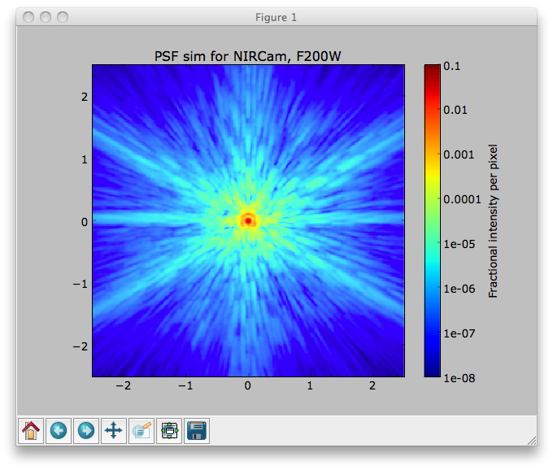
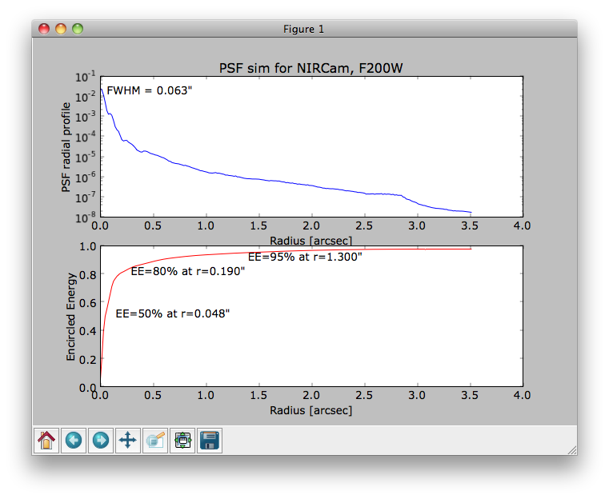
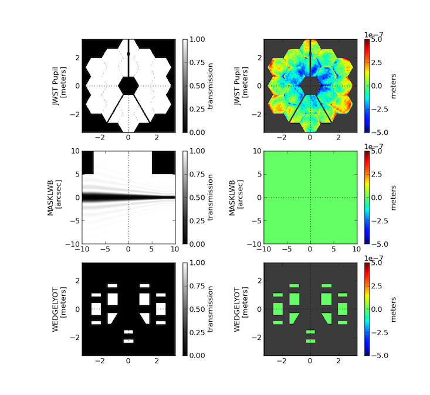
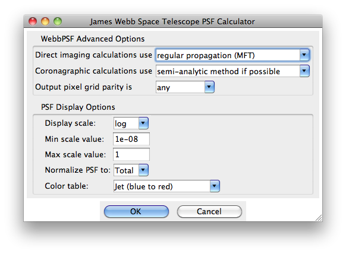

.. _gui:

**********************************************
Using WebbPSF via the Graphical User Interface
**********************************************

The WebbPSF GUI provides an easy interface to most, but not quite all, of the functionality of WebbPSF. (Not all of the advanced settings in the :py:attr:`~webbpsf.JWInstrument.options` structure for :py:class:`webbpsf.JWInstrument` are exposed in the GUI yet, and the programming API is better suited for scripting batch calculations.)

Using the Graphical Interface
=============================

Once you have :ref:`installed WebbPSF <installation.rst>`, you should have the launcher script ``webbpsfgui`` available. (If not, verify that the WebbPSF installation directory is on your system ``$PATH``.)

Alternatively, you may start the GUI from an interactive session::

>>> import webbpsf
>>> webbpsf.gui()

.. figure:: ./fig_gui_main.png
   :scale: 75%
   :align: center
   :alt: The main window of ``webbpsfgui`` when first launched.

   The main window of ``webbpsfgui`` when first launched.

The main window is divided into three regions:

* The top region allows control of the source spectral type and position. (Selecting a source spectral type requires installing the optional dependency :ref:`pysynphot <pysynphot_install>`.)
* The central, main region allows selection of instrument and configuration of instrument options. The options available here largely correspond to attributes of the :py:class:`webbpsf.JWInstrument` classes.
* The lower region contains options for the PSF calculation itself such as pixel sampling and wavelengths. These correspond to parameters of the  :py:meth:`webbpsf.JWInstrument.calcPSF` function call.

GUI Controls
============

The GUI buttons invoke actions as follows:

Compute PSF
-----------

This invokes a PSF calculation with the given options. Each wavelength will be displayed in turn as it is computed, and finally the summed broadband PSF.
This resulting PSF is stored in memory for use by the next three buttons. 

Display PSF
-----------

This button will redisplay the PSF if the window has closed or something else has been displayed.

Display Profiles
----------------

This will display the PSF's radial profile and encircled energy profile.

Save PSF As...
--------------

This will invoke a standard File Save dialog box allowing you to save your new PSF to a FITS file.

Display Optics
--------------

This will display a graphical representation of the optical train for the current instrument configuration.

More Options...
---------------

The 'More Options...' button on the toolbar will bring up a window that allows you to select options controlling the computation of the PSF (e.g. which Fourier transform algorithm is used) or display of the PSF (e.g. which color map to use).

