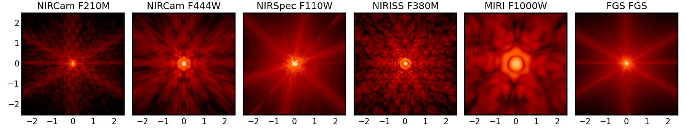

Documentation for WebbPSF 
===============================

.. warning::
   This is a pre-release version of the documentation for WebbPSF version 0.3, which is not quite out yet. There are likely to be references to functionality not yet in the released code. Proceed at your own discretion!

   To install the current development version, see :ref:`install_dev_version`.

WebbPSF is a Python package that computes simulated PSFs for the JWST instruments, taking into account detector pixel scales, rotations, filter profiles, and point source spectra. It is *not* a full optical model of JWST, but rather a tool for transforming optical path difference (OPD) maps, created with some other tool, into the resulting PSFs as observed with JWST's instruments.

   Sample PSFs for JWST's instrument suite, all on the same angular scale and display stretch.

**What this software does:**

* Uses OPD map(s) precomputed by a detailed optical simulation of JWST
* Computes from those a PSF image with requested properties for any of JWST's instruments
* Supports imaging & coronagraphy modes with all of JWST's instruments. Spectroscopy is a work in progress, IFUs are yet to come.
* Provides a suite of tools for quantifying PSF properties such as FWHM, Strehl ratio, etc.

**What this software does NOT do:**

* Contain in itself any detailed thermal or optical model of JWST. For the results of end-to-end integrated simulations of JWST, see for instance `Predicted JWST imaging performance (Knight, Lightsey, & Barto; Proc. SPIE 2012) <http://proceedings.spiedigitallibrary.org/proceeding.aspx?articleid=1362264>`_.
* Model spectrally dispersed PSFs produced by any of the spectrograph gratings. It does, however, let you produce monochromatic PSFs in these modes, suitable for stitching together into spectra using some other software.
* Model any detector effects such as pixel MTF, intrapixel sensitivity variations, interpixel capacitance, or any noise sources. Add those separately with your favorite detector model code.

.. admonition:: How to cite WebbPSF

    In addition to this documentation, WebbPSF is described in `Perrin et al. 2012, "Simulating point spread functions for the James Webb Space Telescope with WebbPSF", <http://adsabs.harvard.edu/abs/2012SPIE.8442E..3DP>`_ Proc SPIE 8842, and in Perrin 2011, `Improved PSF Simulations for JWST: Methods, Algorithms, and Validation <Improved_PSFs_for_Webb.pdf>`_ , JWST Technical report JWST-STScI-002469.

    In particular, the SPIE paper gives a broad overview, while the Technical Report document describes in more detail the relevant optical physics, explains design decisions and motivation for WebbPSF's architecture, and presents extensive validation tests demonstrating consistency between WebbPSF and other PSF simulation packages used throughout the JWST project.

    Users of WebbPSF are encouraged to cite one of those references.

Getting Started with WebbPSF
----------------------------

The WebbPSF software system is composed of two Python packages: a lower-level optical propagation library (:py:mod:`POPPY <poppy>`) plus an implementation of the JWST instruments using that library (:py:mod:`WebbPSF <webbpsf>`).  This documentation explains the programming interfaces and graphical user interface of WebbPSF, as well as providing a :ref:`quick overview <poppy_overiew>` of POPPY.

.. toctree::
   :maxdepth: 1

   intro.rst
   installation.rst
   webbpsf.rst
   gui.rst
   more_examples.rst
   poppy.rst

.. admonition:: Quickstart IPython Notebook

   This documentation is complemented by an `IPython Notebook format quickstart tutorial <http://nbviewer.ipython.org/github/mperrin/webbpsf/blob/master/WebbPSF_tutorial.ipynb>`_. Downloading and running that notebook is a great way to get started using WebbPSF.

Advanced Usage
--------------

.. toctree::
   :maxdepth: 1

   api_reference.rst
   help.rst
   performance.rst
   sampling.rst
   fft_optimization.rst

Appendices and Reference
------------------------

.. toctree::
   :maxdepth: 1

   available_opds.rst
   references.rst
   relnotes.rst

* :ref:`genindex`
* :ref:`search`

**Version Information**

The current version of WebbPSF is version 0.2.8, released Nov 7, 2011. If you would like to receive email announcements of future versions, please contact Marshall Perrin, or send an email to "webbpsf-users-request@stsci.edu" containing the message "subscribe".
