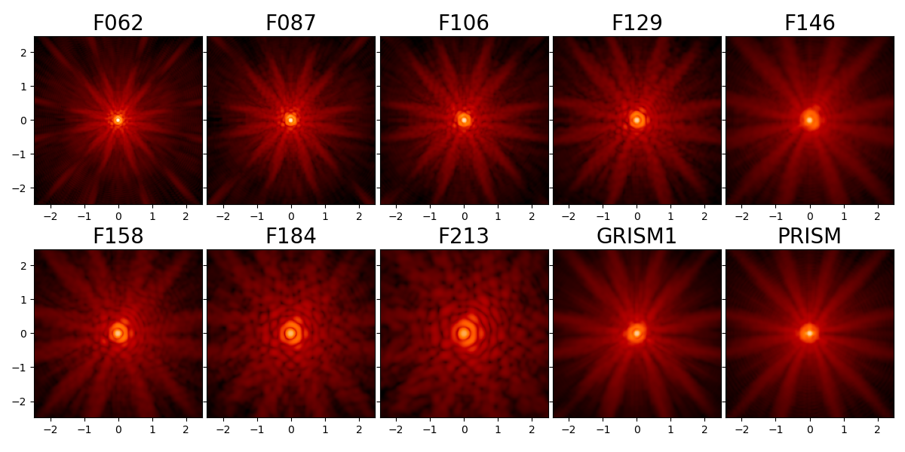

Documentation for WebbPSF
===============================

WebbPSF is a Python package that computes simulated point spread functions (PSFs) for NASA's James Webb Space Telescope (JWST) and Nancy Grace Roman Space Telescope (formerly WFIRST). WebbPSF transforms models of telescope and instrument optical state into PSFs, taking into account detector pixel scales, rotations, filter profiles, and point source spectra. It is *not* a full optical model of JWST, but rather a tool for transforming optical path difference (OPD) maps, created with some other tool, into the resulting PSFs as observed with JWST's or Roman's instruments.

.. figure:: ./fig_instrument_comparison.png
   :scale: 45 %
   :align: center
   :alt: Sample PSFs for JWST's instruments.

   Sample PSFs for JWST's instrument suite, all on the same angular scale and display stretch.

   Sample PSFs for the filters in the Roman WFI.

**Contributors:**
WebbPSF has been developed by Marshall Perrin, Shannon Osborne, Robel Geda, Joseph Long, Justin Otor, Jarron Leisenring, Neil Zimmerman, Keira Brooks, and Anand Sivaramakrishnan, with contributions from Marcio Meléndez Hernandez, Alden Jurling, Lauren Chambers, Ewan Douglas, Charles Lajoie, Megan Sosey, and Kathryn St.Laurent. We also are grateful to the contributors of the astropy-helpers and stsci package templates.

Getting Started with WebbPSF
----------------------------

See :ref:`using_api`.

.. admonition:: Quickstart Jupyter Notebook

   This documentation is complemented by an `Jupyter Notebook format quickstart tutorial <http://nbviewer.jupyter.org/github/spacetelescope/webbpsf/blob/stable/notebooks/WebbPSF_tutorial.ipynb>`_. Downloading and running that notebook is a great way to get started using WebbPSF.

.. note:: 
   *Getting help:* For help using or installing webbpsf, you can contact the STScI JWST Help Desk at jwsthelp.stsci.edu. Note that WebbPSF is included in the Astroconda python distribution, as well as being installable via :ref:`standard Python packaging tools <installation>`.

:ref:`What's new in the latest release? <whatsnew>`

Contents
--------

.. toctree::
   :maxdepth: 1

   intro.rst
   installation.rst
   relnotes.rst
   usage.rst
   jwst.rst
   jwst_optical_budgets.ipynb
   jwst_measured_opds.ipynb
   jwst_wavefront_deltas.ipynb
   roman.rst
   psf_grids.rst
   more_examples.rst
   poppy.rst

Advanced Usage
^^^^^^^^^^^^^^

.. toctree::
   :maxdepth: 1

   api_reference.rst
   help.rst
   performance.rst
   sampling.rst
   fft_optimization.rst

Appendices and Reference
^^^^^^^^^^^^^^^^^^^^^^^^

.. toctree::
   :maxdepth: 1

   available_opds.rst
   field_dependence/multifield_documentation.ipynb
   references.rst
   release.rst

.. admonition:: How to cite WebbPSF

    In addition to this documentation, WebbPSF is described in the following references.  Users of WebbPSF are encouraged to cite one of these.

    * Perrin et al. 2014, `"Updated point spread function simulations for JWST with WebbPSF" <http://adsabs.harvard.edu/abs/2014SPIE.9143E..3XP>`_,  Proc. SPIE. 9143,
    * Perrin et al. 2012, `"Simulating point spread functions for the James Webb Space Telescope with WebbPSF", <http://adsabs.harvard.edu/abs/2012SPIE.8442E..3DP>`_ Proc SPIE 8842, and
    * Perrin 2011, :download:`Improved PSF Simulations for JWST: Methods, Algorithms, and Validation <Improved_PSFs_for_Webb.pdf>`, JWST Technical report JWST-STScI-002469.

    In particular, the 2012 SPIE paper gives a broad overview, the 2014 SPIE paper presents comparisons to instrument cryotest data, and the Technical Report document describes in more detail the relevant optical physics, explains design decisions and motivation for WebbPSF's architecture, and presents extensive validation tests demonstrating consistency between WebbPSF and other PSF simulation packages used throughout the JWST project.

* :ref:`genindex`
* :ref:`search`

**Mailing List**

If you would like to receive email announcements of future versions, please contact Marshall Perrin, or visit `maillist.stsci.edu <https://maillist.stsci.edu/scripts/wa.exe?SUBED1=webbpsf-users&A=1>` to subscribe yourself to the "webbpsf-users@maillist.stsci.edu" list.
