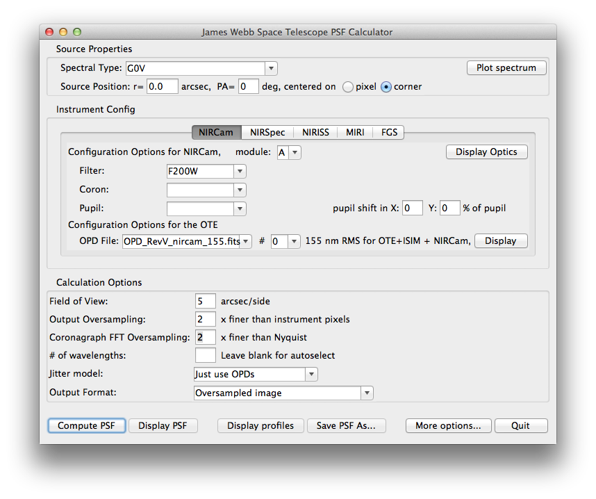

Introduction
============

Conceptually, this simulation code has three layers of abstraction:
 * A base package for wavefront propagation through generic optical systems (provided by :py:mod:`POPPY <poppy>`)
 * Models of the JWST instruments implemented on top of that base system (provided by :py:mod:`WebbPSF <webbpsf>`)
 * An optional :ref:`graphical user interface <gui>`
   
It is entirely possible (and indeed recommended for scripting) to just use the :py:mod:`WebbPSF <webbpsf>` interface without the GUI, but the
GUI can provide a quicker method for many simple interactive calculations.

.. _intro_why_webbpsf:

Why WebbPSF?
------------

WebbPSF replaced an older PSF simulation package,  ``JWPSF``, that was in use prior to 2011. 
From a user's perspective WebbPSF provides the following enhancements over JWPSF:

* Updated to the most recent JWST pupil and OPD models, Revision V.
* Added TFI and FGS models. TFI then updated to NIRISS.
* Updated lists of available filters.
* Added support for coronagraphic and spectroscopic observing modes. 
* Includes the detector rotations, particularly for MIRI and NIRSpec
* Adds ability to set output image FOV size and pixel sampling, separate from the oversampling factor used for the optical propagation.
* New & improved graphical user interface.

Perhaps even more importantly, the underlying codebase has been entirely replaced and revamped. The most 
significant additions from a programmer's perspective include:

* Much cleaner object-oriented interface. Better abstraction of details across layers.
* Support for optics defined by analytic functions
* Support for coordinate rotations and rotated optics.
* Arbitrary oversampling for coronagraphic models.
* Matrix Fourier Transform algorithm from Soummer et al. implemented for arbitrary detector sampling.
* Optional parallelization for improved speed and efficient use of multiple processor cores. 
* Uses ``pysynphot`` library (same as the HST & JWST exposure time calculators) for consistent treatment of filter bandpasses and source spectra.

.. _intro_algorithms:

Algorithms Overview
-------------------

Read on if you're interested in details of how the computations are performed. Otherwise, jump to :ref:`Quick Start <quickstart>`.

The problem at hand is to transform supplied, precomputed OPDs (derived from a detailed optomechanical model
of the telescope)
into observed PSFs as seen with one or more of JWST's various detectors. This requires knowledge of the 
location and orientation of the detector planes, the properties of relevant optics such as bandpass filters and/or
coronagraphic image and pupil plane masks, and a model of light propagation between them.

Instrumental properties are taken from project documentation and the published
literature as appropriate; see the :ref:`References <references>` for detailed
provenance information. Optics may be described either numerically (for
instance, a FITS file containing a mask image for a Lyot plane or a FITS
bintable giving a spectral bandpass) or analytically (for instance, a
coronagraph occulter described as a circle of a given radius or a band-limited
mask function with given free parameters). 

WebbPSF computes PSFs under the assumption that JWST's instruments are well
described by Fraunhofer diffraction, as implemented using the usual Fourier
relationship between optical pupil and image planes (e.g. `Goodman et al. 1996
<http://books.google.com/books?id=ow5xs_Rtt9AC&printsec=frontcover#v=onepage&q&f=false>`_).
Two specific types of 2D Fourier transform are implemented: a Fast Fourier Transform and a discrete Matrix Fourier Transform.

The familiar Fast Fourier Transform (FFT) algorithm achieves its speed at the cost of imposing a specific fixed relationship between pixel
sampling in the pupil and image planes. As a result, obtaining finely sampled PSFs requires transforming very large arrays consisting
mostly of zero-padding. A more computationally attractive method is to use a discrete matrix Fourier transform, which
provides flexibility to compute PSFs on any desired output sampling without requiring any excess padding of the input arrays.
While this algorithm's computational cost grows as `O(N^3)` versus `O(N log N)` for the FFT, the FFT's apparent advantage is immediately lost
due to the need to resample the output onto the real pixel grid, which is an `O(N^2)` operation. By performing a matrix fourier transform 
directly to the desired output pixel scale, we can achieve arbitrarily fine sampling without the use of memory-intensive large padded arrays, and 
with lower overall computation time.

Further optimizations are available in coronagraphic mode using the semi-analytic coronagraphic propagation algorithm of Soummer et al. 2007. In this approach, rather than
propagating the entire wavefront from pupil to image and back to pupil in order to account for the coronagraphic masks, we can propagate only the subset of the wavefront that
is actually blocked by the image occulter and then subtract it from the rest of the wavefront at the Lyot plane. This relies on Babinet's principle to achieve the same final PSF
with more computational efficiency, particularly for the case of highly oversampled image planes (as is necessary to account for fine structure in image plane occulter masks). See Soummer et al. 2007 for a detailed description of this algorithm.

See the :ref:`Appendix on Parallelization and Performance <performance_and_parallelization>` for more details on calculation performance.

Getting WebbPSF
---------------

The WebbPSF software is installable through pip, but it depends on data files distributed through STScI. Since there is more than one way to install scientific Python software, the possibilities are covered in :ref:`installation`.

The very short version, for those who have NumPy, SciPy, and matplotlib already installed::

   $ pip install -U webbpsf

This command installs (or upgrades) WebbPSF to the latest version on `PyPI <https://pypi.python.org/>`_. Next, :ref:`download the WebbPSF data files <data_install>` and set the ``WEBBPSF_DATA`` environment variable to point to the place you extracted them. You may also want to :ref:`install Pysynphot <pysynphot_install>`, an optional dependency, to improve PSF fidelity.

For detailed installation instructions, refer to :ref:`installation`. (This document also explains how to :ref:`install into a conda environment <alternate_install>`, :ref:`install from GitHub source <install_dev_version>`, etc.)

.. _quickstart:

Quick Start
------------
First, download and install the software. Then just start ``python`` and

>>> import webbpsf
>>> webbpsf.gui()

and you should be able to test drive things using the GUI: 

   The main window of the WebbPSF GUI when first launched.

Most controls should be self-explanatory, so feel free to experiment. The article :ref:`gui` provides a detailed
explanation of the GUI options.

WebbPSF can save a detailed log of its calculations and results. This will by default be shown on screen but can also be saved to disk. 

>>> webbpsf.setup_logging(filename='my_log_file.txt')

Log settings are persistent between sessions, so you can just set this once the very first time you start WebbPSF and logging will be enabled thereafter until you explicitly change it.

For further information, consult :ref:`using_api` or :ref:`gui`.