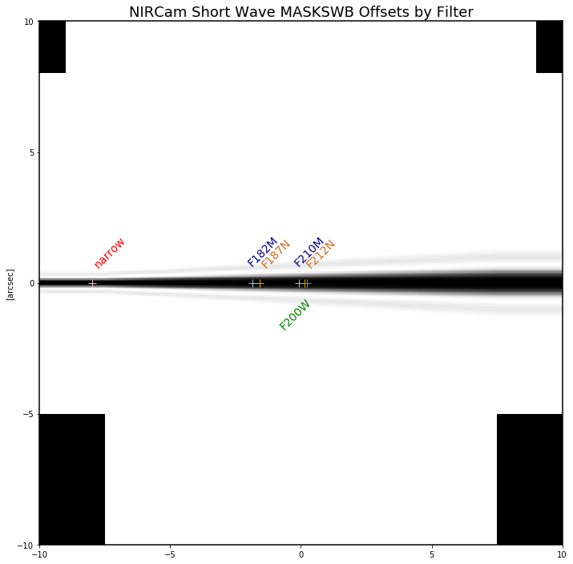
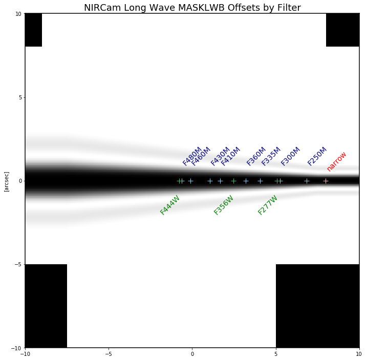
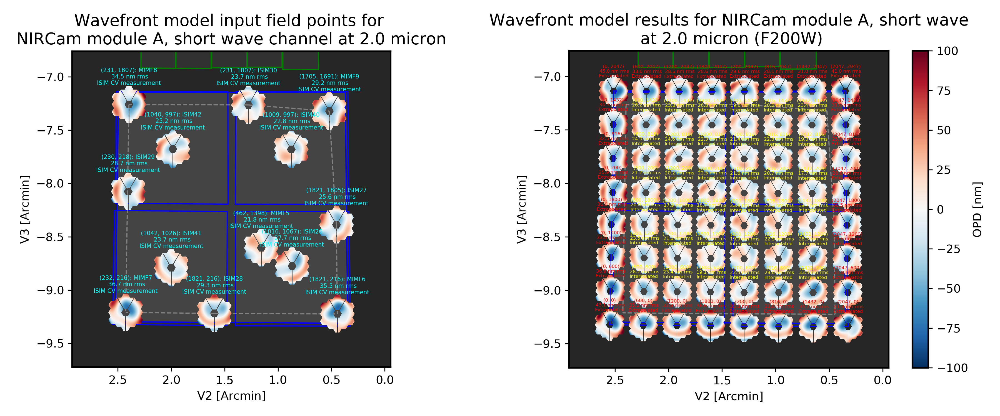
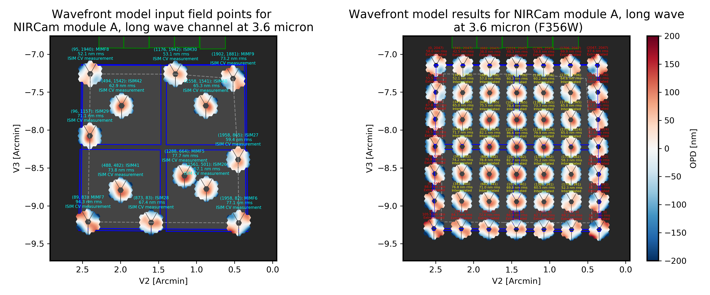
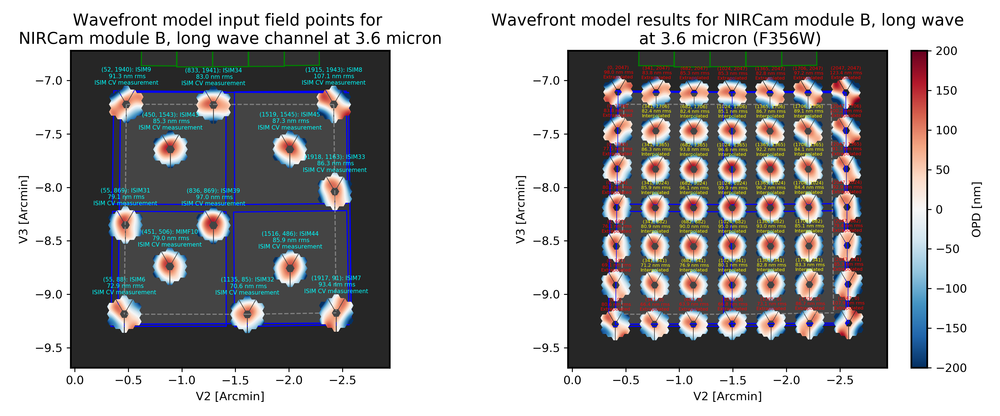
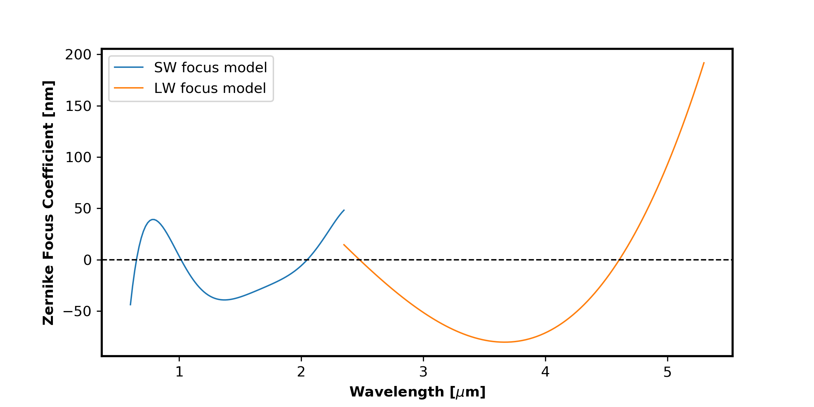
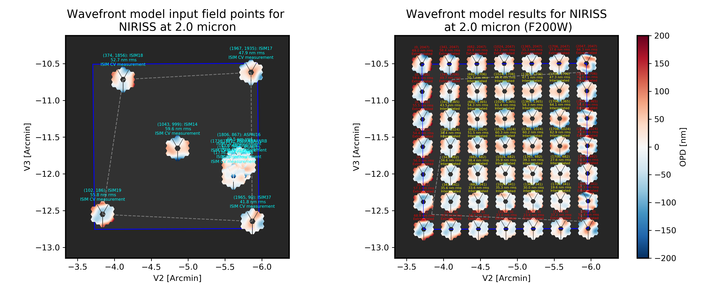
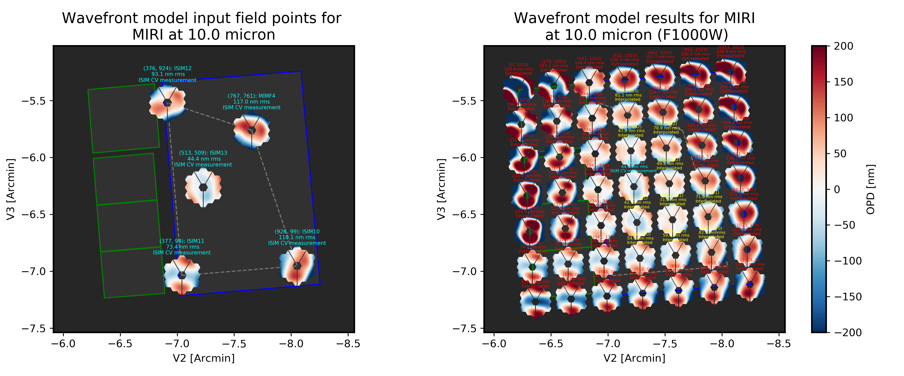
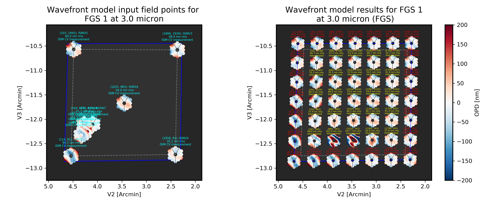
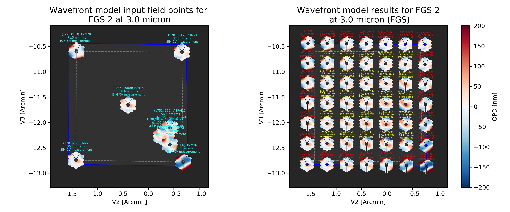

.. _jwst_instruments:

*****************************
JWST Instrument Model Details
*****************************

The following describes specific details for the various JWST instrument classes. See also :ref:`the references page <references>` for information on data sources.

One general note is that the ``webbpsf`` class interfaces do not attempt to exactly
model the implementation details of all instrument mechanisms, particularly for
NIRCam and NIRISS that each have multiple wheels. The
``filter`` attribute of a given class is used to select any and all filters,
even if as a practical matter a given filter is physically installed in a
"pupil" wheel instead of a "filter" wheel. Likewise any masks that affect the
aperture shape are selected via the ``pupil_mask`` attribute even if physically
an optic is in a so-called "filter" wheel.

All classes share some common attributes:

 * ``filter`` which is the string name of the currently selected filter.
   The list of available filters is provided as the ``filter_list`` attribute.
 * ``image_mask`` which is the name of a selected image plane element such as a
   coronagraph mask or spectrograph slit, or ``None`` to indicate no
   such element is present.
   The list of available options is provided as the ``image_mask_list`` attribute.
 * ``pupil_mask`` likewise allows specification of any optic that modifies the pupil plane
   subsequent to the image mask, such as a coronagraphic Lyot stop or spectrograph grating stop.
   The list of available options is provided as the ``pupil_mask_list`` attribute.
 * Each SI has a ``detector`` attribute that can be used to select among its
   multiple detectors (if more than one are present in that SI), and a
   ``detector_position`` attribute which is a 2-tuple giving the pixel coordinates
   on that detector for the center location in any calculated output PSF.
   Note that the ``detector_position`` value should be
   specified using the order (X,Y).
 * The ``aperturename`` attribute provides the `SIAF <https://pysiaf.readthedocs.io>`_ aperture name
   used for transforming between detector position and instrument field of view on the sky. By default
   this will be a full-frame aperture for the currently-selected detector, but you may select any
   subarray aperture or other aperture named in the SIAF for that instrument. The aperturename will always
   update automatically when you select a new detector name. For NIRCam and MIRI,
   the aperturename can also (optionally) automatically update for coronagraphic subarrays if/when a coronagraphic
   optic is selected for the image or pupil mask. .

.. warning::

    WebbPSF provides some sanity checking on user inputs, but does not
    strive to strictly forbid users from trying to simulate instrument
    configurations that  may not be achievable in practice.  Users are
    responsible for knowing the available modes well enough to be aware
    if they are trying to simulate an inconsistent or physically
    impossible configuration.

Optical Telescope Element (OTE)
===============================

The JWST Optical Telescope Element consists of the telescope optics that serve all the science instruments and the fine guidance sensor. Most notably, this means the primary, secondary, tertiary, and fast steering mirrors. The OTE contributes to the overall wavefront error (and therefore the aberrations in instrument PSFs) in a few ways:

  * The limits of precisely manufacturing the mirrors introduce tiny high spatial frequency bumps and ripples of optical path difference
  * During commissioning, the telescope mirror segments will be aligned and phased as precisely as possible, but small errors in the final aligned configuration will still contribute to WFE
  * The WFE will vary with field position, which is inherent in the OTE optical design even if perfectly aligned
  * Aberrations can be introduced by pupil shear or other misalignments between the OTE and each science instrument

These effects are simulated at high fidelity in models maintained by Ball Aerospace, which in turn were used to create the OPD map files for the JWST instruments included in WebbPSF. Specifically, WebbPSF uses information derived from the as-built OTE optical model Revision G (for the static surface figures of each segments) and the overall JWST optical error budget Revision W (for OTE to ISIM misalignments, WFSC residuals, stability, and budgeted uncertainties for both the OTE and SI contributions).

JWST's optical system has been extremely precisely engineered and assembled. Individual mirrors typically have below 30 nm r.m.s. WFE, and the overall OTE system including alignment tolerances and dynamics is expected to deliver wavefronts of roughly 100 to 150 nm r.m.s. WFE to each of the instruments. This corresponds to Strehl ratios of 90% or better for wavelengths beyond 2 microns.

Further information on JWST's predicted optical performance is available in `"Status of the optical performance for the James Webb Space Telescope" <http://dx.doi.org/10.1117/12.2055502>`_, Lightsey *et al.*, (2014) and `"Predicted JWST imaging performance" <http://dx.doi.org/10.1117/12.926817>`_, Knight *et al.* (2012).

For each science instrument, if you examine ``inst.opd_list`` (where ``inst`` is an instance of an instrument model), you will see the filenames for a "predicted" OPD map and a "requirements" OPD map. For example::

   >>> nc = webbpsf.NIRCam()
   >>> nc.opd_list
   ['OPD_RevW_ote_for_NIRCam_predicted.fits.gz',
    'OPD_RevW_ote_for_NIRCam_requirements.fits.gz']

By default, WebbPSF selects the (slightly more conservative) ``requirements`` OPD map::

   >>> nc.pupilopd
   'OPD_RevW_ote_for_NIRCam_requirements.fits.gz'

Performance predictions for a large active deployable space telescope are inherently probabilistic, and Monte Carlo methods have been used to derive overall probability distributions based on the individual error budget terms. The "predicted" OPD maps provided with WebbPSF correspond to the median values from such simulations, and provide a reasonable approximation of current performance expectations. However, performance at such levels is not guaranteed. The "requirements" OPD maps are more conservative, set to the slightly higher levels of residual wavefront error that we can be confident will be achieved in practice. Both the predicted and required values contain maximal budgeted contributions from OTE temporal drifts and dynamics (roughly 55 nm of low and mid frequency error); i.e. they correspond to times well after a wavefront control and shortly before a next set of control moves might be issued.

To select the ``predicted`` map, simply assign it to the ``pupilopd`` attribute before calculating the PSF::

   >>> nc.pupilopd = 'OPD_RevW_ote_for_NIRCam_predicted.fits.gz'

For both the required and predicted cases, the OPD files contain 10 Monte Carlo realizations of the telescope. You can select one of these by specifying the plane number in a tuple::

   >>> nc.pupilopd = ('OPD_RevW_ote_for_NIRCam_predicted.fits.gz', 7)

Note that these represent 10 distinct, totally independent realizations of JWST and its optical error budget. They do not represent any sort of time series or wavefront drift.
The average levels of WFE from the telescope itself used in the OPD files are as follows.

==========  ============  ============
Instrument  Predicted     Requirements
==========  ============  ============
NIRCam       90 nm rms    117 nm rms
NIRSpec     163 nm rms    188 nm rms
NIRISS      108 nm rms    145 nm rms
MIRI        204 nm rms    258 nm rms
==========  ============  ============

While different OPD maps are used for each SI, these OPD maps do not include wavefront error contributions from optics internal to the science instrument. Additional details on the SI-specific wavefront error models are given under each instrument model section below.

NIRCam
======

Imaging
--------

NIRCam is one of the more complicated classes in ``webbpsf``, and has several unique selectable options to model the two copies of NIRCam each with two channels.

The ``detector`` attribute can be used to select between any of the ten detectors,
A1-A5 and B1-B5.  Additional attributes are then automatically set for ``channel``
("short" or "long") and module ("A" or "B") but these cannot be set directly;
just set the desired detector and the channel and module are inferred
automatically.

The choice of ``filter`` also impacts the channel selection: If you choose a
long-wavelength filter such as F460M, then the detector will automatically
switch to the long-wave detector for the current channel. For example, if the
detector was previously set to A2, and the user enters ``nircam.filter = "F460M"``
then the detector will automatically change to A5.  If the user later selects
``nircam.filter = "F212N"`` then the detector will switch to A1 (and the user will
need to manually select if a different short wave detector is desired).  This
behavior on filter selection can be disabled by setting ``nircam.auto_channel = False``.

.. admonition:: NIRCam class automatic pixelscale changes

    The ``pixelscale`` will automatically toggle to the correct scale
    for LW or SW based on user inputs for either detector or filter.
    If you set the ``detector`` to NRCA1-4 or NRCB1-4, the scale will be set for
    SW, otherwise for NRCA5 or NRCB5 the pixel scale will be for LW.
    If you set the ``filter`` attribute to a filter in the short wave channel,
    the pixel scale will be set for SW, otherwise for a filter in the long wave
    challen the scale will be set for LW.

    The intent is that the user should in general automatically get a PSF with the
    appropriate pixelscale for whatever instrument config you're trying to simulate,
    with no extra effort needed by the user to switch between NIRCam's two channels.

    Note that this behavior is *not* invoked for monochromatic calculations; you
    can't just iterate over calc_psf calls at different wavelengths and expect it to
    toggle between SW and LW at some point. The workaround is simple, just set either the
    filter or detector attribute whenever you want to toggle between SW or LW channels.

Coronagraph Masks
------------------

The coronagraph image-plane masks and pupil-plane Lyot masks are all included as options.
These are based on the nominal design properties as provided by the NIRCam team,
not on any specific measurements of the as-built masks. The simulations of the occulting mask
fields also include the nearby neutral density squares for target acquisitions.

WebbPSF won't prevent users from simulating configuration using a coronagraph
image mask without the Lyot stop, but that's not something that can be done for
real with NIRCam.

Note, the Lyot masks have multiple names for historical reasons: The names
'CIRCLYOT' and 'WEDGELYOT' have been used since early in WebbPSF development, and
can still be used, but the same masks can also be referred to as "MASKRND" and
"MASKSWB" or "MASKLWB", the nomenclature that was eventually adopted for use in
APT and other JWST documentation. Both ways work and will continue to do so.

The NIRCam class can automatically switch its ``aperturename`` attribute when a
coronagraphic mask is selected, to select the aperturename for the appropriate
coronagraphic subarray.  The detector reference pixel location will also update
to the center of the coronagraphic subarray. This behavior on image mask or
pupil mask selection can be disabled by setting ``nircam.auto_aperturename =
False``.

**Offsets along the MASKLWB and MASKSWB masks**:

Each allowable filter has its own default location along one of these masks. The appropriate offset is automatically selected
in WebbPSF based on the currently selected filter name. If you want to do something different, you can
set the ``bar_offset`` option::

   >>> nc.options['bar_offset'] = 2.0    # Offsets 2 arcseconds in +X along the mask
   or
   >>> nc.options['bar_offset'] = 'F480M'  # Use the position for F480M regardless of the currently selected filter

Note that just because you can simulate such arbitrary position in WebbPSF does not mean you can
easily actually achieve that pointing with the flight hardware.

.. admonition:: NIRCam class automatic detector position setting for coronagraphy

    Each coronagraphic mask is imaged onto a specific area of a specific detector. Setting the
    image mask attribute to a coronagraphic mask (e.g. MASKLWB or MASK335R) will
    automatically configure the ``detector`` and ``detector_position`` attributes appropriately
    for that mask's field point. Note, this will also invoke the automatic pixelscale functionality
    to get the right scale for SW or LW, too.

Weak Lenses for Wavefront Sensing
---------------------------------

WebbPSF includes models for the three weak lenses used for wavefront sensing, including the
pairs of lenses that can be used together simultaneously.

The convention is such that the "negative" 8 waves lens is concave, the
"positive" two lenses are convex. Thus positive weak lenses move best focus
in front of the detector, or equivalently the electric field imaged on the detector
becomes behind or beyond best focus. Negative weak lenses move best focus behind the detector,
or equivalently the image on the detector is moved closer to the OTE exit pupil
than best focus.

Note that the weak lenses are in the short wave channel only; webbpsf won't stop
you from simulating a LW image with a weak lens, but that's not a real
configuration that can be acheived with NIRCam.

SI WFE
------

SI internal WFE measurements are from ISIM CV3 testing (See JWST-RPT-032131 by David Aronstein et al.)
The SI internal WFE measurements are distinct for each of the modules and
channels. When enabled, these are added to the final pupil of the optical
train, i.e. after the coronagraphic image planes. For field-points outside of
the measurement bounds, WebbPSF performs an extrapolation routine.

   Instrument WFE models for NIRCam. Click for full size.

The coronagraph field points are far off axis, and this comes with significant WFE
added compared to the inner portion of the NIRCam field of view. While SI WFE for
imaging mode were measured directly from the instrument during ISIM CV3, the
coronagraphic WFE maps were built based on the NIRCam Zemax optical model.
This model was first validated in imaging mode, and then the appropriate optical
elements were inserted to produce the coronagraphic configuration.
In this case, both modules were assumed have the exact same (albeit, mirrored)
field-dependent WFE maps. Note, this substantial WFE occurs physically *after*
the coronagraphic focal plane spots in NIRCam, and is modeled as such in WebbPSF.

Wavelength-Dependent Focus Variations
---------------------------------------

NIRCam's wavelength-dependent defocus was measured during ISIM CV2 at a given field point
(See JWST-RPT-029985 by Randal Telfer). Overall, the measurements are consistent with
predictions from the nominal optical model. The departure of the data from the
model curve has been determined to be from residual power in individual filters.
In particular, the F323N filter has a significant extra defocus; WebbPSF includes
this measured defocus if the selected filter is F323N.

   Instrument focus models for NIRCam. Click for full size.

All SI WFE maps were derived from measurements with the F212N and F323N filters.
WebbPSF utilizes polynomial fits to the nominal focus model to derive focus offset values
relative to these narrowband filters for a given wavelength. The derived delta focus
is then translated to a Zernike focus image, which is subsequently applied to the
instrument OPD map.

NIRSpec
=======

Imaging and spectroscopy
------------------------

WebbPSF models the optics of NIRSpec, mostly in **imaging** mode or for monochromatic PSFs that can be assembled into spectra using other tools.

This is not a substitute for a spectrograph model, but rather a way of
simulating a PSF as it would appear with NIRSpec in imaging mode (e.g. for
target acquisition).  It can also be used to produce monochromatic PSFs
appropriate for spectroscopic modes, but other software must be used for
assembling those monochromatic PSFs into a spectrum.

Slits: WebbPSF includes models of each of the fixed slits in NIRSpec (S200A1, S1600A1, and so forth), plus a
few patterns with the MSA: (1) a single open shutter, (2) three adjacent
open shutters to make a mini-slit, and (3) all shutters open at once.
Other MSA patterns could be added if requested by users.

By default the ``pupil_mask`` is set to the "NIRSpec grating" pupil mask.  In
this case a rectangular pupil mask 8.41x7.91 m as projected onto the primary is
added to the optical system at the pupil plane after the MSA. This is an
estimate of the pupil stop imposed by the outer edge of the grating clear
aperture, estimated based on optical modeling by Erin Elliot and Marshall
Perrin.

SI WFE
------

SI internal WFE measurements are from ISIM CV3 testing (See JWST-RPT-032131 by David Aronstein et al.).

The ISIM CV3 data on their own do not indicate how the sources of WFE are distributed within the NIRSpec optical train. For simulation purposes here, the SI WFE measurements are allocated as 1/3 in the foreoptics, prior to the MSA image plane, and 2/3 in the spectrograph optics, after the MSA image plane. This follows a recommendation from Maurice Te Plate of the NIRSpec team, based on metrology and testing of the NIRSpec flight model optics.

.. figure:: ./jwst_figures/opds_combined_for_NIRSpec.png
   :scale: 45 %
   :align: center
   :alt: NIRSpec WFE

   Instrument WFE models for NIRSpec. Click for full size.

NIRISS
======

Imaging and AMI
----------------

WebbPSF models the direct imaging and nonredundant aperture masking interferometry modes of NIRISS in the usual manner.

Note that long wavelength filters (>2.5 microns) are used with a pupil
obscuration which includes the pupil alignment reference fixture. This is called
the "CLEARP" pupil.

Based on the selected filter, WebbPSF will automatically toggle the
``pupil_mask`` between "CLEARP" and the regular clear pupil (i.e.
``pupil_mask = None``).

AMI mask geometry is as provided to the WebbPSF team by Anand Sivaramakrishnan. To match the orientation of the
mask as installed in the flight hardware, the simulated mask model was flipped in X coordinates as of the spring 2019 version of WebbPSF;
thanks to Kevin Volk and Deepashri Thatte for determining this was necessary to match the test data.

Slitless Spectroscopy
---------------------

WebbPSF provides preliminary support for
the single-object slitless
spectroscopy ("SOSS") mode using the GR700XD cross-dispersed grating. Currently
this includes the clipping of the pupil due to the undersized grating and its
mounting hardware, and the cylindrical lens that partially defocuses the light
in one direction.

.. warning::

    Prototype implementation - Not yet fully tested or verified.

Note that WebbPSF does not model the spectral dispersion in any of NIRISS'
slitless spectroscopy modes.  For wide-field slitless spectroscopy, this
can best be simulated by using WebbPSF output PSFs as input to the aXe
spectroscopy code. Contact Van Dixon at STScI for further information.
For SOSS mode, contact Loic Albert at Universite de Montreal.

The other two slitless spectroscopy grisms use the regular pupil and do not require any special
support in WebbPSF; just calculate monochromatic PSFs at the desired wavelengths
and assemble them into spectra using tools such as aXe.

Coronagraph Masks
------------------

NIRISS includes four coronagraphic occulters, machined as features on its
pick-off mirror. These were part of its prior incarnation as TFI, and are not
expected to see much use in NIRISS. However they remain a part of the physical
instrument and we retain in WebbPSF the capability to simulate them.

SI WFE
-------

SI internal WFE measurements are from ISIM CV3 testing (See JWST-RPT-032131 by David Aronstein et al.).

   Instrument WFE models for NIRISS. Click for full size.

MIRI
====

Imaging
-------

WebbPSF models the MIRI imager; currently there is no specific support for MRS,
however monochromatic PSFS computed for the imager may be used as a reasonable
proxy for PSF properties at the entrance to the MRS slicers.

Coronagraphy
-------------

WebbPSF includes models for all three FQPM coronagraphs and the Lyot
coronagraph. In practice, the wavelength selection filters and the Lyot stop are
co-mounted. WebbPSF models this by automatically setting the ``pupil_mask``
element to one of the coronagraph masks or the regular pupil when the ``filter``
is changed. If you want to disable this behavior, set ``miri.auto_pupil = False``.

The MIRI class can automatically switch its ``aperturename`` attribute when a
coronagraphic mask is selected, to select the aperturename for the appropriate
coronagraphic subarray.  The detector reference pixel location will also update
to the center of the coronagraphic subarray. This behavior on image mask
selection can be disabled by setting ``miri.auto_aperturename = False``.

LRS Spectroscopy
----------------

WebbPSF includes models for the LRS slit and the subsequent pupil stop on the
grism in the wheels. Users should select ``miri.image_mask = "LRS slit"`` and ``miri.pupil_mask = 'P750L LRS grating'``.
That said, the LRS simulations have not been extensively tested yet;
feedback is appreciated about any issues encountered.

SI WFE
------

SI internal WFE measurements are from ISIM CV3 testing (See JWST-RPT-032131 by David Aronstein et al.).

The SI internal WFE measurements, when enabled, are added to the final pupil of the optical
train, i.e. after the coronagraphic image planes.

   Instrument WFE models for MIRI. Click for full size.

Minor Field-Dependent Pupil Vignetting
----------------------------------------

**TODO** Add documentation here of this effect and how WebbPSF models it.

A fold mirror at the MIRI Imager's internal cold pupil is used to redirect light from the MIRI calibration sources towards the detector,
to enable flat field calibrations. For a subset of field positions, this fold mirror slightly obscures a small portion of the pupil.
This is a small effect with little practical consequence for MIRI PSFs, but WebbPSF does model it.

FGS
===

The FGS class does not have any selectable optical elements (no filters or
image or pupil masks of any kind). Only the detector is selectable, between
either 'FGS1' or 'FGS2'.

SI WFE
------

SI internal WFE measurements are from ISIM CV3 testing (See JWST-RPT-032131 by David Aronstein et al.).

   Instrument WFE models for FGS. Click for full size.
