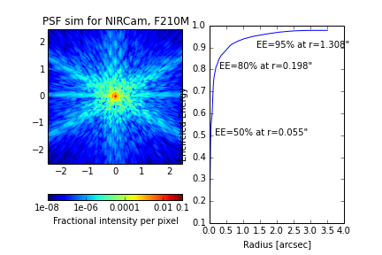
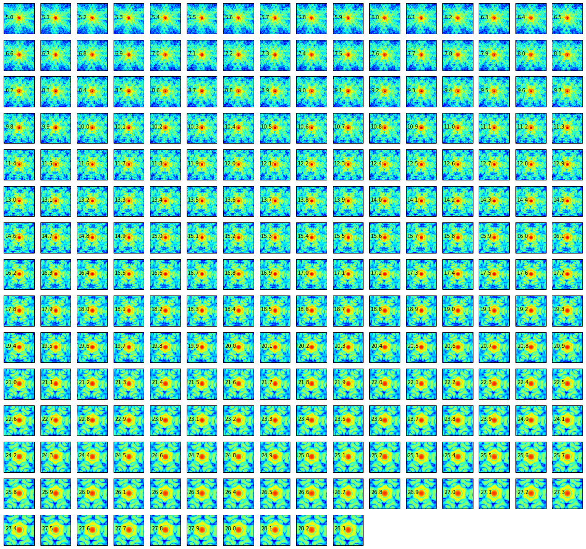
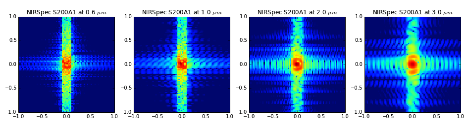
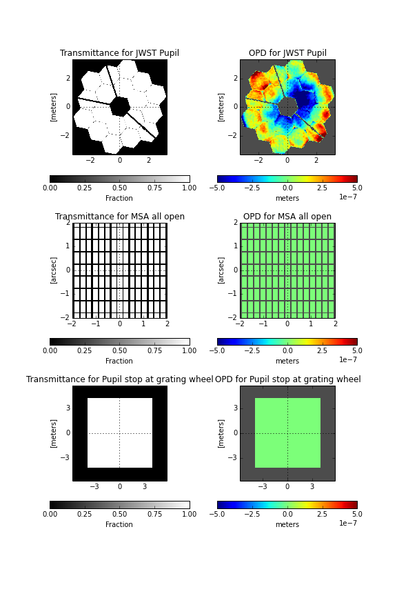
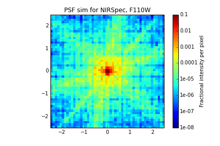
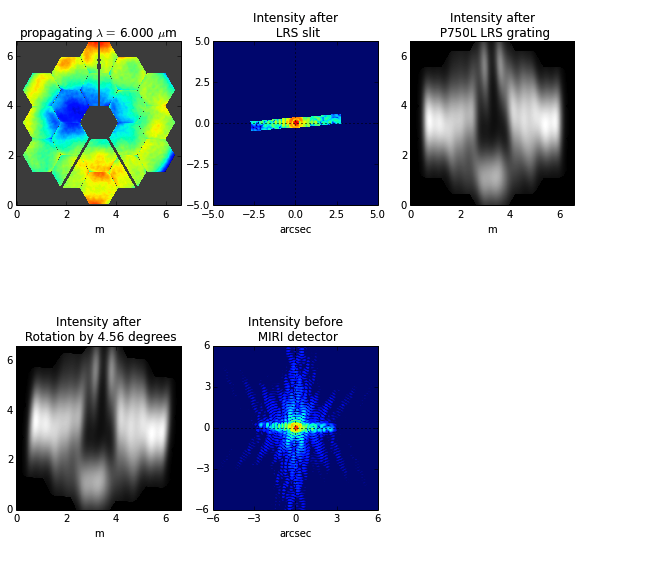
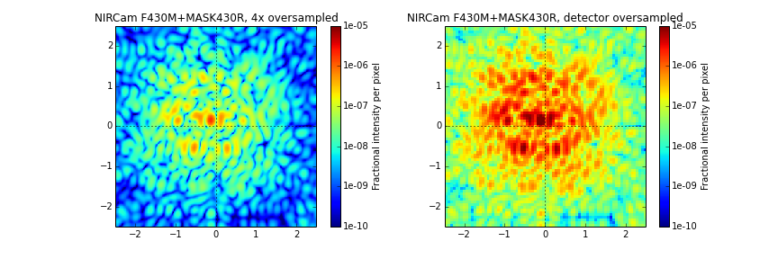

.. _more_examples:

=============================
More Examples
=============================

Any user of Webbpsf is invited to submit snippets of example code for sharing here. 

This code is also available as a
`Jupyter notebook <http://nbviewer.jupyter.org/github/mperrin/webbpsf/blob/master/notebooks/more_examples.ipynb>`_. This version 
of the page is kept for convenience but may be slightly out of date in a few places.

Examples are organized by topic:

 * :ref:`more_examples_general`
 * :ref:`more_examples_spectroscopy`
 * :ref:`more_examples_coronagraphy`

The
`notebook version of this page <http://nbviewer.jupyter.org/github/mperrin/webbpsf/blob/master/notebooks/more_examples.ipynb>`_
includes a fourth section providing examples of all the
major SI modes for each of the JWST instruments.

.. _more_examples_general:

Typical Usage Cases
^^^^^^^^^^^^^^^^^^^^^^^

Displaying a PSF as an image and as an encircled energy plot
-------------------------------------------------------------

.. code-block:: python

    #create a NIRCam instance and calculate a PSF for F210M
    nircam = webbpsf.NIRCam()
    nircam.filter = 'F210M'
    psf210 = nircam.calc_psf(oversample=2)

    # display the PSF and plot the encircled energy
    plt.subplot(1,2,1)
    webbpsf.display_PSF(psf210, colorbar_orientation='horizontal')
    axis2 = plt.subplot(1,2,2)
    webbpsf.display_EE(psf210, ax=axis2)
    
    psf210.writeto('nircam_F210M.fits')
    plt.savefig('plot_nircam_f210m.pdf')

Iterating over multiple OPDs and filters
----------------------------------------

Perhaps you want to calculate PSFs for all filters of a given instrument, using all 10 available simulated OPDs:

.. code-block:: python

    def niriss_psfs():
        niriss = webbpsf.NIRISS()
    
        opdname = niriss.pupilopd
    
        for i in range(10):
            niriss.pupilopd = (opdname,i)
            for filtname in niriss.filter_list:
                niriss.filter=filtname
                fov=18
                outname = "PSF_NIRISS_%scen_wfe%d.fits" % (filtname, i)
                psf = niriss.calc_psf(outname, nlambda=1, oversample=4, fov_arcsec=fov, rebin=True, display=True)
    

Create monochromatic PSFs across an instrument's entire wavelength range
-----------------------------------------------------------------------------
Monochromatic PSFs with steps of 0.1 micron from 5-28.3 micron.

.. code-block:: python
    
    m = webbpsf.MIRI()
    m.pupilopd = 'OPD_RevV_miri_421.fits'       # select an OPD
                                                # looks inside $WEBBPSF_DATA/MIRI/OPD by default
                                                 # or you can specify a full path name.
    m.options['parity'] = 'odd'                 # please make an output PSF with its center
                                                 # aligned to the center of a single pixel
    
    waves = np.linspace(5.0, 28.3, 234)*1e-6     # iterate over wavelengths in meters
    #waves = np.linspace(5.0, 28.3, 20)*1e-6     # iterate over wavelengths in meters
    
    for iw, wavelength in enumerate(waves):
        psffile = 'psf_MIRI_mono_%.1fum_revV_opd1.fits' % (wavelength*1e6)
        psf = m.calc_psf(fov_arcsec=30, oversample=4, rebin=True, monochromatic=wavelength, display=False,
                   outfile=psffile)
        ax = plt.subplot(16,16,iw+1)
        webbpsf.display_PSF(psffile, ext='DET_SAMP', colorbar=False, imagecrop=8)
        ax.set_title('')
        ax.xaxis.set_visible(False)
        ax.yaxis.set_visible(False)
        ax.text(-3.5, 0, '{0:.1f}'.format(wavelength*1e6))

Click to enlarge:

.. _more_examples_spectroscopy:

Spectroscopic PSFs, Slit and Slitless
^^^^^^^^^^^^^^^^^^^^^^^^^^^^^^^^^^^^^^

Note that WebbPSF does not yet compute *dispersed* spectroscopic PSFs, but you can compute monochromatic
PSFs and combine them yourself with an appropriate dispersion model. 

NIRSpec fixed slits
----------------------

.. code-block:: python

    plt.figure(figsize=(8, 12))
    nspec = webbpsf.NIRSpec()
    nspec.image_mask = 'S200A1' # 0.2 arcsec slit
    
    psfs = {}
    for wave in [0.6e-6, 1e-6, 2e-6, 3e-6]:
        psfs[wave] = nspec.calc_psf(monochromatic=wave, oversamp=4)
    
    for i, wave in enumerate([0.6e-6, 1e-6, 2e-6, 3e-6]):
        plt.subplot(1, 4, i+1)
        webbpsf.display_PSF(psfs[wave], colorbar=False, imagecrop=2, title='NIRSpec S200A1 at {0:.1f} $\mu m$'.format(wave*1e6))   
    plt.savefig('example_nirspec_slitpsf.png')

NIRSpec MSA
----------------

.. code-block:: python

    plt.figure(figsize=(8, 12))
    ns = webbpsf.NIRSpec()
    ns.image_mask='MSA all open'
    ns.display()
    plt.savefig('example_nirspec_msa_optics.png')
    msapsf = ns.calc_psf(monochromatic=2e-6, oversample=8, rebin=True)
    webbpsf.display_PSF(msapsf, ext='DET_SAMP')

MIRI LRS
-------------

.. code-block:: python

    miri = webbpsf.MIRI()
    miri.image_mask = 'LRS slit'
    miri.pupil_mask = 'P750L LRS grating'
    psf = miri.calc_psf(monochromatic=6.0e-6, display=True)

.. _more_examples_coronagraphy:

Coronagraphy and Complications
^^^^^^^^^^^^^^^^^^^^^^^^^^^^^^^^^^^^^^

NIRCam coronagraphy with an offset source
-----------------------------------------

.. code-block:: python

    nc = webbpsf.NIRCam()
    nc.filter='F430M'
    nc.image_mask='MASK430R'
    nc.pupil_mask='CIRCLYOT'
    nc.options['source_offset_r'] = 0.20       # source is 200 mas from center of coronagraph
                                               # (note that this is MUCH larger than expected acq 
                                               # offsets. This size displacement is just for show)
    nc.options['source_offset_theta'] = 45     # at a position angle of 45 deg
    nc.calc_psf('coronagraphic.fits', oversample=4, clobber=True)   # create highly oversampled output image
    
    
    plt.figure(figsize=(12,4))
    plt.subplot(1,2,1)
    webbpsf.display_PSF('coronagraphic.fits', vmin=1e-10, vmax=1e-5, 
        ext='OVERSAMP', title='NIRCam F430M+MASK430R, 4x oversampled', crosshairs=True)
    plt.subplot(1,2,2)
    webbpsf.display_PSF('coronagraphic.fits', vmin=1e-10, vmax=1e-5, 
        ext='DET_SAMP', title='NIRCam F430M+MASK430R, detector oversampled', crosshairs=True)
    
    plt.savefig('example_nircam_coron_resampling.png')
    

Simulate NIRCam coronagraphic acquisition images
--------------------------------------------------

.. code-block:: python

    def compute_psfs():
        nc = webbpsf.NIRCam()
    
        # acq filter, occulting mask, lyot, coords of acq ND square
        sets = [('F182M', 'MASKSWB', 'WEDGELYOT', -10,  7.5),
                ('F182M', 'MASK210R', 'CIRCLYOT', -7.5, 7.5),
                ('F335M', 'MASKLWB', 'WEDGELYOT',  7.5, 7.5),
                ('F335M', 'MASK335R', 'CIRCLYOT', -10,  7.5)]
    
        nlambda = 9     
        oversample = 2  
    
        calc_oversample=4
    
        fov_arcsec = 25
    
        for param in sets:
            nc.filter = param[0]
            nc.image_mask = param[1]
            nc.pupil_mask = param[2]
            source_offset_x = param[3]
            source_offset_y = param[4]
    
    
            source_offset_r = np.sqrt(source_offset_x**2+ source_offset_y**2)
            source_offset_theta = np.arctan2(source_offset_x, source_offset_y)*180/np.pi
            nc.options['source_offset_r'] = source_offset_r
            nc.options['source_offset_theta'] = source_offset_theta
    
    
            filename = "PSF_NIRCam_%s_%s_%s_offset.fits" % (param[0], param[1], param[2])
            result = nc.calc_psf(nlambda=nlambda, 
                oversample=oversample, calc_oversample=calc_oversample, 
                fov_arcsec=fov_arcsec, outfile=filename, display=False)
    
    

Iterate a calculation over all MIRI coronagraphic modes
-------------------------------------------------------

.. code-block:: python

    def miri_psfs_coron():
        miri = webbpsf.MIRI()
    
        for filtwave in [1065, 1140, 1550, 2300]:
    
            miri.filter='F%4dC' % filtwave
            if filtwave<2000:
                miri.image_mask='FQPM%4d' % filtwave
                miri.pupil_mask='MASKFQPM'
                fov=24
            else:
                miri.image_mask='LYOT2300'
                miri.pupil_mask='MASKLYOT'
                fov=30
    
    
            offset_x = 0.007 # arcsec
            offset_y = 0.007 # arcsec
    
            miri.options['source_offset_r'] = np.sqrt(offset_x**2+offset_y**2) # offset in arcsec
            miri.options['source_offset_theta'] = np.arctan2(-offset_x, offset_y)*180/np.pi # PA in deg
    
    
            outname = "PSF_MIRI_%s_x%+05.3f_y%+05.3f.fits" % (miri.image_mask, offset_x, offset_y)
            psf = miri.calc_psf(outname, oversample=4, fov_arcsec=fov, display=True)
    
    

Make plots of encircled energy in PSFs at various wavelengths
----------------------------------------------------------------

.. code-block:: python

    def miri_psfs_for_ee():
        miri = webbpsf.MIRI()
    
        opdname = miri.pupilopd
    
        for i in range(10):
            miri.pupilopd = (opdname,i)
            for wave in [5.0, 7.5, 10, 14]:
    
                fov=18
    
                outname = "PSF_MIRI_%.1fum_wfe%d.fits" % (wave, i)
                psf = miri.calc_psf(outname, monochromatic=wave*1e-6, 
                        oversample=4, fov_arcsec=fov, rebin=True, display=True)
    
    
    
    def plot_ee_curves():
        plt.clf()
        for iw, wave in enumerate([5.0, 7.5, 10, 14]):
    
            ees60 = []
            ees51 = []
            ax = plt.subplot(2,2,iw+1)
            for i in range(10):
                name = "PSF_MIRI_%.1fum_wfe%d.fits" % (wave, i)
                webbpsf.display_EE(name, ax=ax, mark_levels=False)
    
                eefn = webbpsf.measure_EE(name)
                ees60.append(eefn(0.60))
                ees51.append(eefn(0.51))
    
            ax.text(1, 0.6, 'Mean EE inside 0.60": %.3f' % np.asarray(ees60).mean())
            ax.text(1, 0.5, 'Mean EE inside 0.51": %.3f' % np.asarray(ees51).mean())
    
            ax.set_title("Wavelength = %.1f $\mu$m" % wave)
    
            ax.axvline(0.6, ls=":", color='k')
            ax.axvline(0.51, ls=":", color='k')
    
    
        plt.tight_layout()
    

Simulate coronagraphy with pupil shear, saving the wavefront intensity in the Lyot pupil plane
------------------------------------------------------------------------------------------------

This is an example of a much more complicated calculation, including code to generate publication-quality plots. 

There are two functions here, one that creates a simulated PSF for a given amount of shear, and one that makes some nice plots of it.

.. code-block:: python

    def miri_psf_sheared(shearx=0, sheary=0, nopds = 1, display=True, overwrite=False, \*\*kwargs):
        """ Compute MIRI coronagraphic PSFs assuming pupil shear between the MIRI lyot mask and the OTE
    
        Parameters
        ------------
        shearx, sheary: float
            Shear across the pupil expressed in percent, 
            i.e. shearx=3 means the coronagraph pupil is sheared by 3% of the primary.
    
        """
        miri = webbpsf.MIRI()
    
        miri.options['pupil_shift_x'] = shearx/100 # convert shear amount to float between 0-1
        miri.options['pupil_shift_y'] = sheary/100
    
        opdname = miri.pupilopd         # save default OPD name for use in iterating over slices
    
        filtsets = [('F1065C', 'FQPM1065', 'MASKFQPM'), ('F2300C','LYOT2300','MASKLYOT')]
    
        fov=10
    
        for i in range(nopds):
            miri.pupilopd = (opdname,i)
            for filt, im_mask, pup_mask in filtsets:
                print("Now computing OPD %d for %s, %s, %s" % (i, filt, im_mask, pup_mask))
                miri.filter=filt
                miri.image_mask = im_mask
                miri.pupil_mask = pup_mask
    
    
                outname = "PSF_MIRI_%s_wfe%d_shx%.1f_shy%.1f.fits" % (filt, i, shearx, sheary)
                outname_lyot = outname.replace("PSF_", 'LYOTPLANE_')
    
    
                if os.path.exists(outname) and not overwrite:
                    print ("File %s already exists. Skipping and continuing for now... "
                           " Set overwrite=True to recalculate" % outname)
                    return
    
                psf, intermediates = miri.calc_psf(oversample=4, fov_arcsec=fov, 
                        rebin=True, display=display, return_intermediates=True, \*\*kwargs)
    
                lyot_intensity = intermediates[4]
    
                psf.writeto(outname, clobber=True)
                lyot_intensity.writeto(outname_lyot, clobber=True, includepadding=False)
    
    
    def plot_sheared_psf(shearx=1.0, sheary=0, lyotmax=1e-5, psfmax = 1e-3, diffmax=10):
        i = 0
        filtsets = [('F1065C', 'FQPM1065', 'MASKFQPM')]#, ('F2300C','LYOT2300','MASKLYOT')]
    
        plt.clf()
        plt.subplots_adjust(left=0.02, right=0.98, wspace=0.3)
        for filt, im_mask, pup_mask in filtsets:
            perfectname = "PSF_MIRI_%s_wfe%d_shx%.1f_shy%.1f.fits" % (filt, i, 0,0)
            perfectname_lyot = perfectname.replace("PSF_", 'LYOTPLANE_')
    
    
            outname = "PSF_MIRI_%s_wfe%d_shx%.1f_shy%.1f.fits" % (filt, i, shearx, sheary)
            outname_lyot = outname.replace("PSF_", 'LYOTPLANE_')
    
            if not os.path.exists(outname):
                print "File %s does not exist, skipping" % outname
                return False
    
    
            #psf = pyfits.open(outname)
            #perfpsf = pyfits.open(perfectname)
            lyot = pyfits.open(outname_lyot)
            perflyot = pyfits.open(perfectname_lyot)
    
            wzero = np.where(lyot[0].data == 0)
            wzero = np.where(lyot[0].data < 1e-15)
            lyot[0].data[wzero] = np.nan
            wzero = np.where(perflyot[0].data == 0)
            perflyot[0].data[wzero] = np.nan
    
            cmap = matplotlib.cm.jet
            cmap.set_bad('gray')
    
    
    
            # plot comparison perfect case Lyot Intensity
            ax = plt.subplot(231)
            plt.imshow(perflyot[0].data, vmin=0, vmax=lyotmax, cmap=cmap)
            plt.title("Lyot plane, no shear")
            ax.yaxis.set_ticklabels("")
            ax.xaxis.set_ticklabels("")
    
            wg = np.where(np.isfinite(perflyot[0].data))
            ax.set_xlabel("Residual flux = %.1f%%" % (perflyot[0].data[wg].sum()*100))
    
            # plot shifted pupil Lyot intensity
            ax = plt.subplot(234)
            plt.imshow(lyot[0].data, vmin=0, vmax=lyotmax, cmap=cmap)
            plt.title("Lyot plane, shear (%.1f, %.1f)" % (shearx, sheary))
            ax.yaxis.set_ticklabels("")
            ax.xaxis.set_ticklabels("")
            wg = np.where(np.isfinite(lyot[0].data))
            ax.set_xlabel("Residual flux = %.1f%%" % (lyot[0].data[wg].sum()*100))
    
    
    
            # Radial profile plot
            plt.subplot(233)
    
            radius, profperf = webbpsf.radial_profile(perfectname, ext=1)
            radius2, profshear = webbpsf.radial_profile(outname, ext=1)
    
            # normalize all radial profiles to peak=1 for an unocculted source
            radiusu, profunocc = webbpsf.radial_profile('PSF_MIRI_F1065C_wfe0_noshear_unocculted.fits', 
                ext=1, center=(43.3, 68.6)) # center is in pixel coords
    
            peakunocc = profunocc.max()
            profperf /= peakunocc
            profshear/= peakunocc
            profunocc/= peakunocc
    
    
            plt.semilogy(radius, profperf, label="No shear")
            plt.semilogy(radius2, profshear, label="shear (%.1f, %.1f)" % (shearx, sheary))
            plt.semilogy(radiusu, profunocc, label="Unocculted", ls=":" )
    
    
            plt.xlabel("Separation [arcsec]")
            plt.ylabel("Relative Intensity")
            plt.legend(loc='upper right')
            plt.gca().set_xlim(0,6)
    
    
            # plot comparison perfect case PSF - detector sampled
            plt.subplot(232)
            webbpsf.display_PSF(perfectname, ext=1, vmax=psfmax)
            plt.title("PSF, no shear")
    
            # plot shifted pupil PSF - detector sampled
            plt.subplot(235)
            webbpsf.display_PSF(outname, ext=1, vmax=psfmax)
            plt.title("PSF, shear (%.1f, %1.f)" % (shearx, sheary))
            plt.xlabel("Separation [arcsec]")
            # difference PSf
            plt.subplot(236)
            webbpsf.display_PSF_difference(outname, perfectname, ext1=1, 
                ext2=1, vmax=diffmax, vmin=-0.1, normalize_to_second=True)
            plt.title('Relative PSF increase')
            plt.xlabel("Separation [arcsec]")
    
    
            return True
    
    

..
  Copy in some examples here from test_webbpsf and validate_webbpsf ? 

