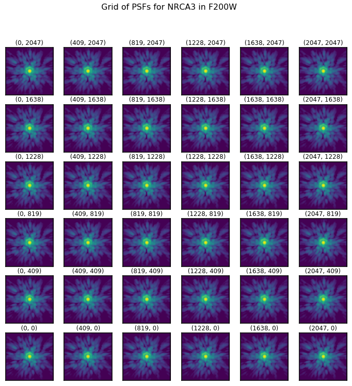
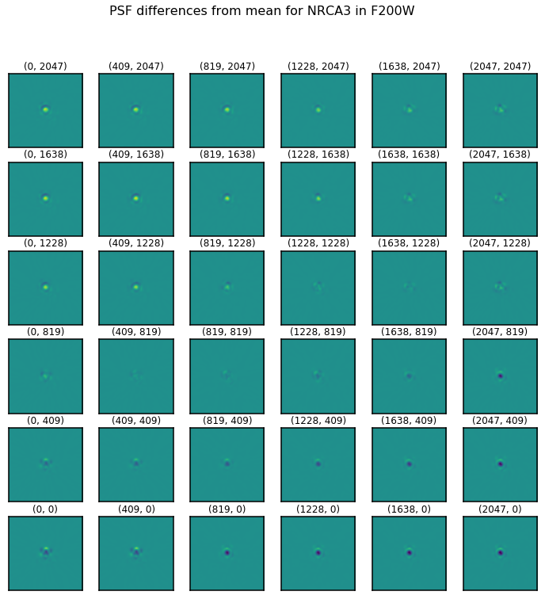

*****************
Using PSF Grids
*****************

WebbPSF includes functionality designed to work with the Photutils package to
enable precise PSF-fitting photometry and astrometry. This makes use of the
`GriddedPSFModel` class (available in Photutils > 0.6), which implements a
version of the empirical or effective PSF ("ePSF") modeling framework pioneered by Jay
Anderson, Ivan King, and collaborators. This approach has been highly successful with
HST and other space observatories, and we expect it will also be productive with JWST. 
In practice we will want to use ePSF models derived from real observations, but for now
we can make them in simulation. 

The first step is to create a grid of fiducial PSFs spanning the
instrument/detector of choice. This can be done using the :meth:`~webbpsf.JWInstrument.psf_grid` method
which will output a (list of or single) photutils GriddedPSFModel
object(s). Users can then use photutils to apply interpolation to the grid to
simulate a spatially dependent PSF anywhere on the instrument, without having
to perform a full PSF calculation at each location. This faster approach is
critical if you're dealing with potentially tens of thousands of stars
scattered across many megapixels of detector real estate.

.. admonition:: Jupyter Notebook

    See `this Gridded PSF Library tutorial notebook <https://github.com/spacetelescope/webbpsf/blob/stable/notebooks/Gridded_PSF_Library.ipynb>`_
    for more details and example code.

Example PSF grid
^^^^^^^^^^^^^^^^

PSF grid calculations are useful for visualizing changes in the PSF across instrument fields of view. Here's one example of that. 

.. code-block:: python

    nrc = webbpsf.NIRCam()
    nrc.filter='F212N'
    nrc.detector='NRCA3'
    grid = nrc.psf_grid(num_psfs=36, all_detectors=False)
    webbpsf.gridded_library.display_psf_grid(grid)

   An example of grid calculated across the NRCA3 detector in NIRCam. These PSFs are all very similar.

   By subtracting off the average PSF, the subtle differences from point to point become clear. 
   The PSF is sharpest in the upper left corner of this detector.
