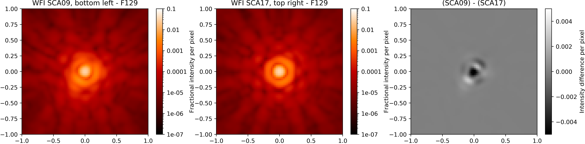
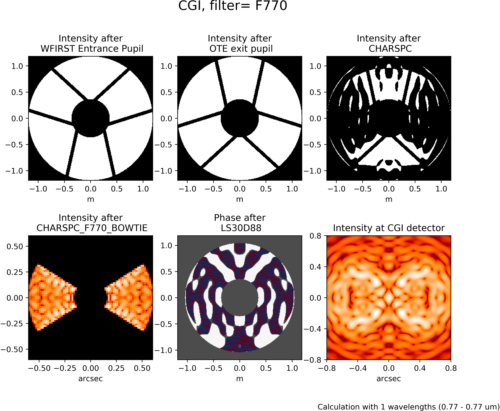

*******************************
Roman Instrument Model Details
*******************************

WebbPSF provides a framework for instrument PSF calculations that is easily extensible to other instruments and observatories. The :py:mod:`webbpsf.roman` module was developed to enable simulation of Roman's instruments, the :ref:`Wide Field Instrument (WFI) <roman_wfi>` and :ref:`Coronagraph Instrument <roman_coronagraph>`.

.. _roman_wfi:

Wide Field Instrument (WFI)
===========================

.. figure:: ./roman_figures/webbpsf-roman_page_header.png
   :align: center
   :alt: Sample PSFs for the filters in the Roman WFI.

   Sample PSFs for the filters in the Roman WFI. Angular scale in arcseconds, log-scaled intensity.

The WFI model is based on the `Cycle 9 instrument reference information <https://roman.gsfc.nasa.gov/science/Roman_Reference_Information.html>`_ from the Roman team at Goddard Space Flight Center (GSFC). The reported jitter for the Roman observatory is 0.012 arcsec per axis, per `GSFC <https://roman.ipac.caltech.edu/sims/Param_db.html#telescope>`_.

To work with the WFI model, import and instantiate it just like any of the JWST instruments::

    >>> from webbpsf import roman
    >>> wfi = roman.WFI()

Usage of the WFI model class is, for the most part, just like any other WebbPSF instrument model. For help setting attributes like filters, position offsets, and sampling, refer to :ref:`using_api`.

The WFI model includes a model for field dependent PSF aberrations. With as large a field of view as the WFI is designed to cover, there will be variation in the PSF from one end of the field of view to the other. WebbPSF's WFI model faithfully reproduces the field dependent aberrations calculated from the Goddard Roman team's Cycle 9 WFI design. This provides a toolkit for users to assess the impact of inter-SCA and intra-SCA PSF variations on science cases of interest.

.. note::

   *Tutorial notebook for Roman*

   This documentation is complemented by an `IPython Notebook tutorial for Roman PSFs <http://nbviewer.ipython.org/github/spacetelescope/webbpsf/blob/stable/notebooks/WebbPSF-Roman_Tutorial.ipynb>`_. Download and run that notebook to use a beta notebook GUI for the WFI model, and to explore code samples for common tasks interactively.

.. caution::

   Note that unlike most JWST modes, Roman WFI is *significantly* undersampled relative to Nyquist.
   Undersampled data is inherently lossy with information, and subject to aliasing. Measurements of
   properties such as encircled energy, FWHM, Strehl ratio, etc. cannot be done precisely on
   undersampled data.

   In flight, we will use dithering and similar strategies to reconstruct better-sampled images. The
   same can be done in simulation using WebbPSF. **Only measure PSF properties such as FWHM or
   encircled energy on well-sampled data**. That means either simulating dithered undersampled data
   at multiple subpixel steps and drizzling them back together, or else performing your measurements
   on oversampled calculation outputs. (I.e. in webbpsf, set `wfi.oversample=4` or more, and perform
   your measurements on extension 0 of the returned FITS file.)

Field dependence in the WFI model
---------------------------------

Field points are specified in a WebbPSF calculation by selecting a detector and pixel coordinates within that detector. A newly instantiated WFI model already has a default detector and position. ::

   >>> wfi.detector
   'SCA01'
   >>> wfi.detector_position
   (2048, 2048)

.. figure:: ./roman_figures/field_layout.png
   :alt: The Wide Field Instrument's field of view, as projected on the sky.

   The Wide Field Instrument's field of view, as projected on the sky.

The WFI field of view is laid out as shown in the figure. To select a different detector, assign its name to the ``detector`` attribute::

   >>> wfi.detector_list
   ['SCA01', 'SCA02', 'SCA03', 'SCA04', 'SCA05', 'SCA06', 'SCA07', 'SCA08', 'SCA09', 'SCA10', 'SCA11', 'SCA12', 'SCA13', 'SCA14', 'SCA15', 'SCA16', 'SCA17', 'SCA18']
   >>> wfi.detector = 'SCA03'

The usable, photosensitive regions of the Wide Field Instrument's detectors are slightly smaller than their 4096 by 4096 pixel dimensions because the outermost four rows and columns are reference pixels that are not sensitive to light. To change the position at which to calculate a PSF, assign an (X, Y) tuple::

   >>> wfi.detector_position = (4, 400)

The reference information available gives the field dependent aberrations in terms of Zernike polynomial coefficients from :math:`Z_1` to :math:`Z_{22}`. These coefficients were calculated for five field points on each of 18 detectors, each at 18 unique wavelengths providing coverage from 0.76 :math:`\mu m` to 2.3 :math:`\mu m` (that is, the entire wavelength range of the WFI). WebbPSF interpolates the coefficients in position and wavelength space to allow the user to simulate PSFs at any valid pixel position and wavelength.
WebbPSF will approximate the aberrations for an out of range detector position by using the nearest field point.

Bear in mind that the pixel position you set does not automatically set the **centering** of your calculated PSF. As with other models in WebbPSF, an ``options`` dictionary key can be set to specify 'even' (center on crosshairs between four pixels) or 'odd' (center on pixel center) parity. ::

   >>> wfi.options['parity'] = 'even'  # best case for dividing PSF core flux
   >>> wfi.options['parity'] = 'odd'  # worst case for PSF core flux landing in a single pixel

Example: Computing the PSF difference between opposite corners of the WFI field of view
-----------------------------------------------------------------------------------------

This example shows the power of WebbPSF to simulate and analyze field dependent variation in the model. About a dozen lines of code are all that's necessary to produce a figure showing how the PSF differs between the two extreme edges of the instrument field of view.

::

   >>> wfi = roman.WFI()
   >>> wfi.filter = 'F129'
   >>> wfi.detector = 'SCA09'
   >>> wfi.detector_position = (4, 4)
   >>> psf_sca09 = wfi.calc_psf()
   >>> wfi.detector = 'SCA17'
   >>> wfi.detector_position = (4092, 4092)
   >>> psf_sca17 = wfi.calc_psf()
   >>> fig, (ax_sca09, ax_sca17, ax_diff) = plt.subplots(1, 3, figsize=(16, 4))
   >>> webbpsf.display_psf(psf_sca09, ax=ax_sca09, imagecrop=2.0,
                           title='WFI SCA09, bottom left - F129')
   >>> webbpsf.display_psf(psf_sca17, ax=ax_sca17, imagecrop=2.0,
                           title='WFI SCA17, top right - F129')
   >>> webbpsf.display_psf_difference(psf_sca09, psf_sca17, ax=ax_diff,
                                       vmax=5e-3, title='SCA09 - SCA17', imagecrop=2.0)

   This figure shows oversampled PSFs in the F129 filter at two different field points, and the intensity difference image between the two.

Pupil variation and pupil masks in the WFI model
------------------------------------------------

As before, the Cycle 9 reference data release from the Goddard Space Flight Center features field-dependent pupil images for the WFI. However, this cycle's pupil images are categorized in a manner that diverges from that of previous cycles.

A plurality of the filters -- F062, F087, F106, F129, and F158 -- now use the "Skinny" mask, which is exclusive to the imaging mode. The remaining imaging filters, F184 and the new F213, share F184's "Wide" mask. Both the undispersed zeroth order and dispersed first order of the grism mode share the eponymous "Grism" mask. Finally, though the prism mode operates sans obstruction, its maskless arrangement is termed the "Prism" mask for the sake of consistency.

Please note that these pupil mask category names are not fully backward compatible with those from previous versions of WebbPSF. For example, the `pupil_mask_list` of `['AUTO', 'FULL_MASK', 'RIM_MASK', 'COLD_PUPIL', 'UNMASKED']` in versions 0.9.X is now obsolete.

.. figure:: ./roman_figures/pupil_mask_by_sca.gif
   :alt: Pupil masks at different field points.

   Pupil masks at different field points.

The pupil and pupil mask are dynamically selected as needed whenever the detector or filter is changed. To override this behavior for either attribute, see `WFI.lock_pupil()` and `WFI.lock_pupil_mask()`. The following pupils are available:

============   ===========================================
Pupil Mask     pupil_mask setting
============   ===========================================
Skinny Mask    'SKINNY' (formerly 'RIM_MASK', 'UNMASKED')
Wide Mask      'WIDE' (formerly 'FULL_MASK', 'COLD_PUPIL')
Grism Mask     'GRISM'
Prism Mask     'PRISM' (formerly 'RIM_MASK', 'UNMASKED')
============   ===========================================

.. _roman_coronagraph:

Coronagraph Instrument
======================

We have begun developing a Coronagraph Instrument simulation module.
The goal is to provide
an open source modeling package for the Coronagraph Instrument for use by the science centers and
science teams, to complement the existing in-house optical modeling
capabilities at JPL.

Currently a prototype implementation is available for the shaped pupil
coronagraph modes only, for both the Coronagraph imager and IFS. Future releases will incorporate realistic aberrations, both
static and dynamic, to produce realistic speckle fields.  We also plan to
add the hybrid Lyot modes.

.. warning::
    The Coronagraph model has not been actively updated or developed since circa 2017.
    It does not well represent the current PDR-level state of the instrument. There are plans
    to refresh this model. Interested users should contact Ewan Douglas.

.. warning::
    Current functionality is limited to the Shaped Pupil Coronagraph (SPC)
    observing modes, and these modes are only simulated with static, unaberrated
    wavefronts, without relay optics and without DM control. The design
    represented here is an approximation to a baseline concept, and will be
    subject to change based on ongoing trades studies and technology development.

A hands-on tutorial in using the RomanCoronagraph class is available in this
`Jupyter Notebook <http://nbviewer.ipython.org/github/spacetelescope/webbpsf/blob/stable/notebooks/roman_coronagraph_demo.ipynb>`_.
Here we briefly summarize the key points, but see that for more detail.

The RomanCoronagraph class has attributes for  ``filter``, etc., like other instrument classes, but since these masks are designed to be
used in specific combinations, a ``mode`` attribute exists that allows easy specification of all those attributes at once. For example, setting ::
    >>> cor = roman.RomanCoronagraph()
    >>> cor.mode = "CHARSPC_F770"

is equivalent to::

    >>> cor.camera = 'IFS'
    >>> cor.filter = 'F770'
    >>> cor.apodizer = 'CHARSPC'
    >>> cor.fpm = 'CHARSPC_F770_BOWTIE'
    >>> cor.lyotstop = 'LS30D88'

There are ``_list`` attributes that tell you the allowed values for each attribute, including a ``mode_list`` for all the available meta-modes.

Calculations are invoked similarly to any other instrument class::

    >> mono_char_spc_psf = cor.calc_psf(nlambda=1, fov_arcsec=1.6, display=True)

