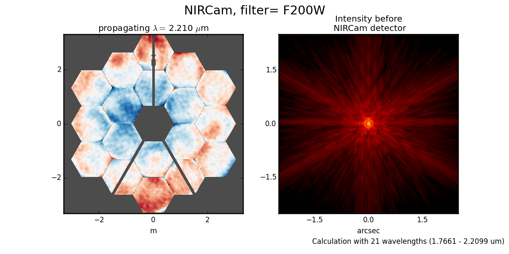
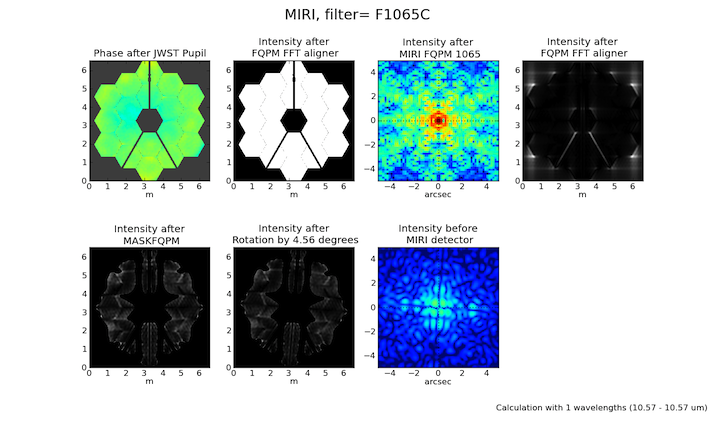

.. module:: webbpsf

.. _using_api:

********************************
Using WebbPSF via the Python API
********************************

This module provides the primary interface for programmers and for interactive non-GUI use. It provides 
five classes corresponding to the JWST instruments, with consistent interfaces.  
See :ref:`this page <detailed_api>` for the detailed API; for now let's dive into some example code.

:ref:`Additional code examples <more_examples>` are available later in this documentation.

Usage and Examples
==================

Simple PSFs are easily obtained: 

    >>> import webbpsf
    >>> nc = webbpsf.NIRCam()
    >>> nc.filter =  'F200W'
    >>> psf = nc.calcPSF(oversample=4)      # returns a pyfits.HDUlist containing PSF and header
    >>> pylab.imshow(psf[0].data]           # display it on screen yourself, or
    >>> display_PSF(psf)                    # use this convenient function to make a nice log plot with labeled axes
    >>>
    >>> psf = nc.calcPSF(filter='F470N', oversample=4)    # this is just a shortcut for setting the filter, then computing a PSF
    >>>
    >>> nc.calcPSF("myPSF.fits", filter='F480M' )         # you can also write the output directly to disk if you prefer.

For interactive use, you can have the PSF displayed as it is computed:

    >>> nc.calcPSF(display=True)                          # will make nice plots with matplotlib.

More complicated instrumental configurations are available by setting the instrument's attributes. For instance,
one can create an instance of MIRI and configure it for coronagraphic observations, thus:

    >>> miri = webbpsf.MIRI()
    >>> miri.filter = 'F1065C'
    >>> miri.image_mask = 'FQPM1065'
    >>> miri.pupil_mask = 'MASKFQPM'
    >>> miri.calcPSF('outfile.fits')

Input Source Spectra
--------------------

WebbPSF attempts to calculate realistic weighted broadband PSFs taking into account both the source spectrum and the instrumental spectral response. 

The default source spectrum is, if :py:mod:`pysynphot` is installed, a G2V star spectrum from Castelli & Kurucz 2004. Without :py:mod:`pysynphot`, the default is a simple flat spectrum such that the same number of photons are detected at each wavelength.

You may choose a different illuminating source spectrum by specifying a ``source`` parameter in the call to ``calcPSF()``. The following are valid sources:

1. A :py:class:`pysynphot.Spectrum` object. This is the best option, providing maximum ease and accuracy, but requires the user to have :py:mod:`pysynphot` installed.  In this case, the :py:class:`Spectrum` object is combined with a :py:class:`pysynphot.ObsBandpass` for the selected instrument and filter to derive the effective stimulus in detected photoelectrons versus wavelength. This is binned to the number of wavelengths set by the ``nlambda`` parameter. 
2. A dictionary with elements ``source["wavelengths"]`` and ``source["weights"]`` giving the wavelengths in meters and the relative weights for each. These should be numpy arrays or lists. In this case, the wavelengths and weights are used exactly as provided, without applying the instrumental filter profile. 

   >>> src = {'wavelengths': [2.0e-6, 2.1e-6, 2.2e-6], 'weights': [0.3, 0.5, 0.2]}
   >>> nc.calcPSF(source=src, outfile='psf_for_src.fits')

3. A tuple or list containing the numpy arrays ``(wavelength, weights)`` instead.

As a convenience, webbpsf includes a function to retrieve an appropriate :py:class:`pysynphot.Spectrum` object for a given stellar spectral type from the PHOENIX or Castelli & Kurucz model libraries. 

   >>> src = webbpsf.specFromSpectralType('G0V', catalog='phoenix')
   >>> psf = miri.calcPSF(source=src)

Making Monochromatic PSFs
---------------------------------

To calculate a monochromatic PSF, just use the ``monochromatic`` parameter. Wavelengths are always specified in meters.

   >>> psf = miri.calcPSF(monochromatic=9.876e-6)

Adjusting source position, centering, and output format
-------------------------------------------------------

A number of non-instrument-specific calculation options can be adjusted through the `options` dictionary attribute on each instrument instance. (For a complete listing of options available, consult :py:attr:`JWInstrument.options`.)

Input Source position offsets
^^^^^^^^^^^^^^^^^^^^^^^^^^^^^

The PSF may be shifted off-center by adjusting the offset of the stellar source. This is done in polar coordinates:

>>> instrument.options['source_offset_r'] = 0.3         # offset in arcseconds
>>> instrument.options['source_offset_theta'] = 45.     # degrees counterclockwise from instrumental +Y in the science frame

If these options are set, the offset is applied relative to the central coordinates as defined by the output array size and parity (described just below).

For coronagraphic modes, the coronagraph occulter is always assumed to be at the center of the output array. Therefore, these options let you offset the source away from the coronagraph.

Simulating telescope jitter
^^^^^^^^^^^^^^^^^^^^^^^^^^^

Space-based observatories don't have to contend with the seeing limit, but imprecisions in telescope pointing can have the effect of smearing out the PSF. To simulate this with WebbPSF, the option names are ``jitter`` and ``jitter_sigma``.

>>> instrument.options['jitter'] = 'gaussian'   # jitter model name or None
>>> instrument.options['jitter_sigma'] = 0.009  # in arcsec, default 0.007

Array sizes, star positions, and centering
^^^^^^^^^^^^^^^^^^^^^^^^^^^^^^^^^^^^^^^^^^

Output array sizes may be specified either in units of arcseconds or pixels.  For instance, 

>>> mynircam = webbpsf.NIRCam()
>>> result = mynircam.calcPSF(fov_arcsec=7, oversample=2, filter='F250M')
>>> result2= mynircam.calcPSF(fov_pixels=512, oversample=2, filter='F250M')

In the latter example, you will in fact get an array which is 1024 pixels on a side: 512 physical detector pixels, times an oversampling of 2.

By default, the PSF will be centered at the exact center of the output array. This means that if the PSF is computed on an array with an odd number of pixels, the
PSF will be centered exactly on the central pixel. If the PSF is computed on an array with even size, it will be centered on the "crosshairs" at the intersection of the central four pixels.
If one of these is particularly desirable to you, set the parity option appropriately:

>>>  instrument.options['parity'] = 'even'
>>>  instrument.options['parity'] = 'odd'

Setting one of these options will ensure that a field of view specified in arcseconds is properly rounded to either odd or even when converted from arcsec to pixels. Alternatively, 
you may also just set the desired number of pixels explicitly in the call to calcPSF():

>>>  instrument.calcPSF(fov_npixels=512)

.. note::

    Please note that these parity options apply to the number of *detector
    pixels* in your simulation. If you request oversampling, then the number of
    pixels in the output file for an oversampled array will be
    ``fov_npixels`` times ``oversampling``. Hence, if you request an odd
    parity with an even oversampling of, say, 4, then you would get an array
    with a total number of data pixels that is even, but that correctly represents
    the PSF located at the center of an odd number of detector pixels.

Output format options for sampling
^^^^^^^^^^^^^^^^^^^^^^^^^^^^^^^^^^

As just explained, WebbPSF can easily calculate PSFs on a finer grid than the detector's native pixel scale. You can select whether the output data should include this oversampled image, a copy that has instead been rebinned down to match the detector scale, or optionally both. This is done using the ``options['output_mode']`` parameter.

   >>> nircam.options['output_mode'] = 'oversampled'
   >>> psf = nircam.calcPSF()       # the 'psf' variable will be an oversampled PSF, formatted as a FITS HDUlist
   >>>
   >>> nircam.options['output_mode'] = 'detector sampled'
   >>> psf2 = nircam.calcPSF()      # now 'psf2' will contain the result as resampled onto the detector scale.
   >>>
   >>> nircam.options['output_mode'] = 'both'
   >>> psf3 = nircam.calcPSF()      # 'psf3' will have the oversampled image as primary HDU, and
   >>>                              # the detector-sampled image as the first image extension HDU.

.. warning::
    The default behavior is `both`. Note that at some point in the future, this default is likely to change to detector sampling.
    To future-proof your code, set `options['output_mode']` explicitly.

Pixel scales, sampling, and oversampling
----------------------------------------

The derived instrument classes all know their own instrumental pixel scales. You can change the output 
pixel scale in a variety of ways, as follows. See the :py:class:`JWInstrument.calcPSF` documentation for more details.

1. Set the ``oversample`` parameter to calcPSF(). This will produce a PSF with a pixel grid this many times more finely sampled. 
   ``oversample=1`` is the native detector scale, ``oversample=2`` means divide each pixel into 2x2 finer pixels, and so forth.
   You can automatically obtain both the oversampled PSF and a version rebinned down onto the detector pixel scale by setting `rebin=True` 
   in the call to calcPSF:

   >>> hdulist = instrument.calcPSF(oversample=2, rebin=True)     # hdulist will contain a primary HDU with the 
   >>>                                                            # oversampled data, plus an image extension 
   >>>                                                            # with the PSF rebinned down to regular sampling.

   

2. For coronagraphic calculations, it is possible to set different oversampling factors at different parts of the calculation. See the ``calc_oversample`` and ``detector_oversample`` parameters. This
   is of no use for regular imaging calculations (in which case ``oversample`` is a synonym for ``detector_oversample``). Specifically, the ``calc_oversample`` keyword is used for Fourier transformation to and from the intermediate optical plane where the occulter (coronagraph spot) is located, while ``detector_oversample`` is used for propagation to the final detector. Note that the behavior of these keywords changes for coronagraphic modeling using the Semi-Analytic Coronagraphic propagation algorithm (not fully documented yet - contact Marshall Perrin if curious). 

   >>> miri.calcPSF(calc_oversample=8, detector_oversample= 2)    # model the occulter with very fine pixels, then save the 
   >>>                                                           # data on a coarser (but still oversampled) scale

3. Or, if you need even more flexibility, just change the ``instrument.pixelscale`` attribute to be whatever arbitrary scale you require. 

   >>> instrument.pixelscale = 0.0314159

 
Note that the calculations performed by WebbPSF are somewhat memory intensive, particularly for coronagraphic observations. All arrays used internally are 
double-precision complex floats (16 bytes per value), and many arrays of size `(npixels * oversampling)^2` are needed (particularly if display options are turned on, since the
matplotlib graphics library makes its own copy of all arrays displayed).

Your average laptop with a couple GB of RAM will do perfectly well for most computations so long as you're not too ambitious with setting array size and oversampling.
If you're interested in very high fidelity simulations of large fields (e.g. 1024x1024 pixels oversampled 8x) then we recommend a large multicore desktop with >16 GB RAM. 

.. _normalization:

PSF normalization
-----------------

By default, PSFs are normalized to total intensity = 1.0 at the entrance pupil (i.e. at the JWST OTE primary). A PSF calculated for an infinite aperture would thus have integrated intensity =1.0. A PSF calculated on any smaller finite subarray will have some finite encircled energy less than one. For instance, at 2 microns a 10 arcsecond size FOV will enclose about 99% of the energy of the PSF.  Note that if there are any additional obscurations in the optical system (such as coronagraph masks, spectrograph slits, etc), then the fraction of light that reaches the final focal plane will typically be significantly less than 1, even if calculated on an arbitrarily large aperture. For instance the NIRISS NRM mask has a throughput of about 15%, so a PSF calculated in this mode with the default normalization will have integrated total intensity approximately 0.15 over a large FOV.

If a different normalization is desired, there are a few options that can be set in calls to calcPSF::

    >>>  psf = nc.calcPSF(normalize='last')

The above will normalize a PSF after the calculation, so the output (i.e. the PSF on whatever finite subarray) has total integrated intensity =1.0.  ::

    >>>  psf = nc.calcPSF(normalize='exit_pupil')

The above will normalize a PSF at the exit pupil (i.e. last pupil plane in the optical model). This normalization takes out the effect of any pupil obscurations such as coronagraph masks, spectrograph slits or pupil masks, the NIRISS NRM mask, and so forth. However it still leaves in the effect of any finite FOV. In other words, PSFs calculated in this mode will have integrated total intensity = 1.0 over an infinitely large FOV, even after the effects of any obscurations.

.. note::

       An aside on throughputs and normalization: Note that *by design* WebbPSF
       does not track or model the absolute throughput of any instrument.
       Consult the JWST Exposure Time Calculator and associated reference
       material if you are interested in absolute throughputs. Instead WebbPSF
       simply allows normalization of output PSFs' total intensity to 1 at
       either the entrance pupil, exit pupil, or final focal plane. When used
       to generate monochromatic PSFs for use in the JWST ETC, the entrance
       pupil normalization option is selected. Therefore WebbPSF first applies
       the normalization to unit flux at the primary mirror, propagates it
       through the optical system ignoring any reflective or transmissive
       losses from mirrors or filters (since the ETC throughput curves take
       care of those), and calculates only the diffractive losses from slits
       and stops. Any loss of light from optical stops (Lyot stops,
       spectrograph slits or coronagraph masks, the NIRISS NRM mask, etc.) will
       thus be included in the WebbPSF calculation.  Everything else (such as
       reflective or transmissive losses, detector quantum efficiencies, etc.,
       plus scaling for the specified target spectrum and brightness) is the
       ETC's job. This division of labor has been coordinated with the ETC team
       and ensures each factor that affects throughput is handled by one or the
       other system but is not double counted in both.

       To support realistic calculation of broadband PSFs however, WebbPSF does
       include normalized copies of the relative spectral response functions
       for every filter in each instrument.  These are included in the WebbPSF
       data distribution, and are derived behind the scenes from the same
       reference database as is used for the ETC. These relative spectral
       response functions are used to make a proper weighted sum of the
       individual monochromatic PSFs in a broadband calculation: weighted
       *relative to the broadband total flux of one another*, but still with no implied
       absolute normalization.

Controlling output log text
---------------------------

WebbPSF can output a log of calculation steps while it runs, which can be displayed to the screen and optionally saved to a file.
This is useful for verifying or debugging calculations.  To turn on log display, just run

    >>> webbpsf.setup_logging(filename='webbpsf.log')

The setup_logging function allows selection of the level of log detail following the standard Python logging system (DEBUG, INFO, WARN, ERROR).
To disable all printout of log messages, except for errors, set

    >>> webbpsf.setup_logging(level='ERROR')

WebbPSF remembers your
chosen logging settings between invocations, so if you close and then restart python it will automatically continue logging at the same level of detail as before.
See :py:func:`webbpsf.setup_logging` for more details.

Advanced Usage: Output file format, OPDs, and more
==================================================

This section serves as a catch-all for some more esoteric customizations and applications. See also the :ref:`more_examples` page.

Writing out only downsampled images
-----------------------------------

Perhaps you may want to calculate the PSF using oversampling, but to save disk space you only want to write out the PSF downsampled to detector resolution.

   >>> result =  inst.calcPSF(args, ...)
   >>> result['DET_SAMP'].writeto(outputfilename)

Or if you really care about writing it as a primary HDU rather than an extension, replace the 2nd line with

   >>> pyfits.PrimaryHDU(data=result['DET_SAMP'].data, header=result['DET_SAMP'].header).writeto(outputfilename)

Writing out intermediate images
-------------------------------

Your calculation may involve intermediate pupil and image planes (in fact, it most likely does). WebbPSF / POPPY allow you to inspect the intermediate pupil and image planes visually with the display keyword argument to :py:meth:`~webbpsf.JWInstrument.calcPSF`. Sometimes, however, you may want to save these arrays to FITS files for analysis. This is done with the ``save_intermediates`` keyword argument to :py:meth:`~webbpsf.JWInstrument.calcPSF`.

The intermediate wavefront planes will be written out to FITS files in the current directory, named in the format ``wavefront_plane_%03d.fits``. You can additionally specify what representation of the wavefront you want saved with the ``save_intermediates_what`` argument to :py:meth:`~webbpsf.JWInstrument.calcPSF`. This can be ``all``, ``parts``, ``amplitude``, ``phase`` or ``complex``, as defined as in :py:meth:`poppy.Wavefront.asFITS`. The default is to write ``all`` (intensity, amplitude, and phase as three 2D slices of a data cube).

If you pass ``return_intermediates=True`` as well, the return value of calcPSF is then ``psf, intermediate_wavefronts_list`` rather than the usual ``psf``.

.. warning::

   The ``save_intermediates`` keyword argument does not work when using parallelized computation, and WebbPSF will fail with an exception if you attempt to pass ``save_intermediates=True`` when running in parallel. The ``return_intermediates`` option has this same restriction.

Providing your own OPDs or pupils from some other source
--------------------------------------------------------

It is straight forward to configure an Instrument object to use a pupil OPD file of your own devising, by setting the ``pupilopd`` attribute of the Instrument object:

        >>> niriss = webbpsf.NIRISS()
        >>> niriss.pupilopd = "/path/to/your/OPD_file.fits"

If you have a pupil that is an array in memory but not saved on disk, you can pass it in as a fits.HDUList object :

        >>> myOPD = some_function_that_returns_properly_formatted_HDUList(various, function, args...)
        >>> niriss.pupilopd = myOPD

Likewise, you can set the pupil transmission file in a similar manner by setting the ``pupil`` attribute: 

        >>> niriss.pupil = "/path/to/your/OPD_file.fits"

Please see the documentation for :py:class:`poppy.FITSOpticalElement` for information on the required formatting of the FITS file.
In particular, you will need to set the `PUPLSCAL` keyword, and OPD values must be given in units of meters.

Subclassing a JWInstrument to add additional functionality
----------------------------------------------------------

Perhaps you want to modify the OPD used for a given instrument, for instance to
add a defocus. You can do this by subclassing one of the existing instrument
classes to override the :py:meth:`JWInstrument._addAdditionalOptics` function. An :py:class:`OpticalSystem <poppy.OpticalSystem>` is
basically a list so it's straightforward to just add another optic there. In
this example it's a lens for defocus but you could just as easily add another
:py:class:`FITSOpticalElement <poppy.FITSOpticalElement>` instead to read in a disk file.

Note, we do this as an example here to show how to modify an instrument class by
subclassing it, which can let you add arbitrary new functionality. 
There's an easier way to add defocus specifically; see below. 

    >>> class FGS_with_defocus(webbpsf.FGS):
    >>>     def __init__(self, *args, **kwargs):
    >>>         webbpsf.FGS.__init__(self, *args, **kwargs)
    >>>         # modify the following as needed to get your desired defocus
    >>>         self.defocus_waves = 0
    >>>         self.defocus_lambda = 4e-6
    >>>     def _addAdditionalOptics(self, optsys, *args, **kwargs):
    >>>         optsys = webbpsf.FGS._addAdditionalOptics(self, optsys, *args, **kwargs)
    >>>         lens = poppy.ThinLens(
    >>>             name='FGS Defocus',
    >>>             nwaves=self.defocus_waves,
    >>>             reference_wavelength=self.defocus_lambda
    >>>         )
    >>>         lens.planetype = poppy.PUPIL  # tell propagation algorithm which this is
    >>>         optsys.planes.insert(1, lens)
    >>>         return optsys
    >>>
    >>> fgs2 = FGS_with_defocus()
    >>> # apply 4 waves of defocus at the wavelength
    >>> # defined by FGS_with_defocus.defocus_lambda
    >>> fgs2.defocus_waves = 4
    >>> psf = fgs2.calcPSF()
    >>> webbpsf.display_PSF(psf)

Defocusing an instrument
--------------------------------

The instrument options dictionary also lets you specify an optional defocus
amount.  You can specify both the wavelength at which it should be applied, and
the number of waves of defocus (at that wavelength, specified as waves
peak-to-valley over the circumscribing circular pupil of JWST). 

   >>> nircam.options['defocus_waves'] = 3.2
   >>> nircam.options['defocus_wavelength'] = 2.0e-6

