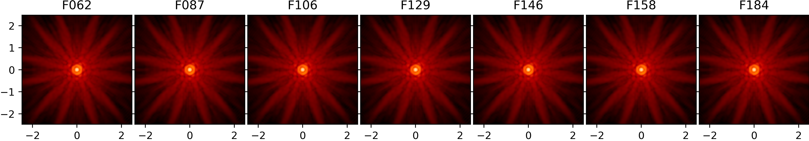
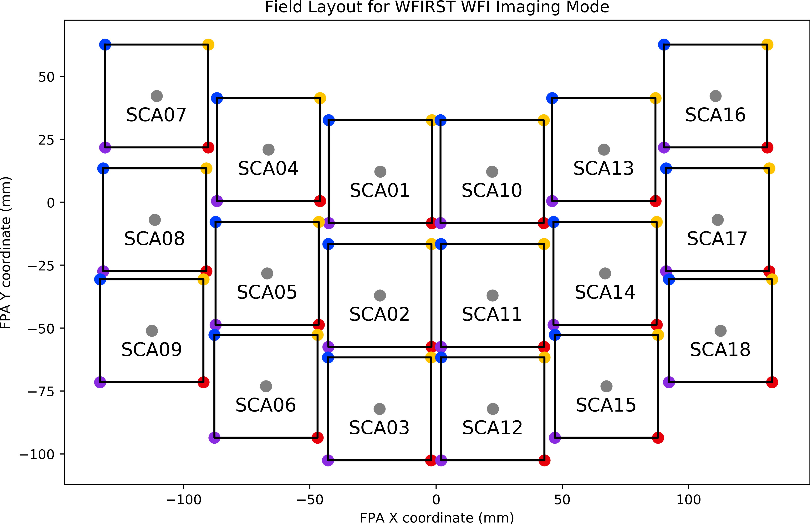
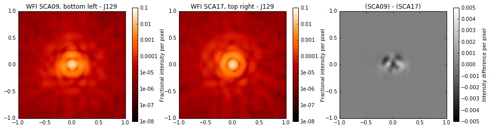

******************
WebbPSF for WFIRST
******************

   Sample PSFs for the filters in the WFIRST WFI. Angular scale in arcseconds, log-scaled intensity.

Introduction
============

WebbPSF provides a framework for JWST instrument PSF calculations that is easily extensible to other instruments and observatories. The :py:mod:`webbpsf.wfirst` module was developed to enable simulation of WFIRST's Wide Field Instrument (WFI) based on the `Cycle 5 instrument reference information <http://wfirst.gsfc.nasa.gov/science/Instrument_Reference_Information.html>`_ from the WFIRST team at Goddard Space Flight Center.

At this time, the only instrument simulated is the WFI, but that may change in the future. To work with the WFI model, import and instantiate it as follows::

>>> import webbpsf
>>> from webbpsf import wfirst
>>> wfi = wfirst.WFI()

Usage of the WFI model class is, for the most part, just like any other WebbPSF instrument model. For help setting things like filters, position offsets, and sampling refer back to :ref:`using_api`.

What is different (and, for now, only available for the WFIRST WFI) is the support for field dependent aberrations. With as large a field of view as the WFI is designed to cover, there will be variation in the PSF from one end of the field of view to the other. WebbPSF's WFI model faithfully reproduces the field dependent aberrations calculated from the Goddard WFIRST team's Cycle 5 WFI design. This provides a toolkit for users to assess the impact of inter-SCA and intra-SCA PSF variations on science cases of interest.

.. admonition:: Quickstart IPython Notebook

   This documentation is complemented by an `IPython Notebook format quickstart tutorial <http://nbviewer.ipython.org/github/mperrin/webbpsf/blob/master/notebooks/WebbPSF-WFIRST_Tutorial.ipynb>`_. Downloading and run that notebook to use the beta notebook GUI for the WFI model, and to explore code samples for common tasks interactively.

Field dependence in the WFI model
=================================

Field points are specified in a WebbPSF calculation by selecting a detector and pixel coordinates within that detector. A newly instantiated WFI model already has a default detector and position. ::

   >>> wfi.detector
   'SCA01'
   >>> wfi.detector_position
   (2048, 2048)

The WFI field of view is laid out as shown in the figure. To select a different detector, assign its name to the ``detector`` attribute::

   >>> wfi.detector_list
   ['SCA01', 'SCA02', 'SCA03', 'SCA04', 'SCA05', 'SCA06', 'SCA07', 'SCA08', 'SCA09', 'SCA10', 'SCA11', 'SCA12', 'SCA13', 'SCA14', 'SCA15', 'SCA16', 'SCA17', 'SCA18']
   >>> wfi.detector = 'SCA03'

The usable region of the 4096 by 4096 pixel detectors specified for the Wide Field Instrument will range from (4, 4) to (4092, 4092), accounting for the 4 pixel wide bands of reference pixels. To change the position at which to calculate a PSF, simply assign an (X, Y) tuple::

   >>> wfi.detector_position = (4, 400)

.. warning::

   WebbPSF will not prevent you from setting an out of range detector position, but an error will be raised if you try to calculate a PSF with one. ::

      >>> wfi.detector_position = (1, 1)
      >>> wfi.calcPSF()
      [ ... traceback omitted ... ]
      RuntimeError: Attempted to get aberrations for an out-of-bounds field point

The reference information available gives the field dependent aberrations in terms of Zernike polynomial coefficients from :math:`Z_1` to :math:`Z_{22}`. These coefficients were calculated for five field points on each of 18 detectors, each at 16 unique wavelengths providing coverage from 0.76 :math:`\mu m` to 2.0 :math:`\mu m` (that is, the entire wavelength range of the WFI). WebbPSF interpolates the coefficients in position and wavelength space to allow the user to simulate PSFs at any valid pixel position and wavelength.

Bear in mind that the pixel position you set does not automatically set the **centering** of your calculated PSF. As with other models in WebbPSF, an ``options`` dictionary key can be set to specify 'even' (center on crosshairs between four pixels) or 'odd' (center on pixel center) parity. ::

   >>> wfi.options['parity'] = 'even'  # best case for dividing PSF core flux
   >>> wfi.options['parity'] = 'odd'  # worst case for PSF core flux landing in a single pixel

Example: Computing the PSF difference between opposite corners of the field of view
======================================================================================

This example shows the power of WebbPSF to simulate and analyze field dependent variation in the model. About a dozen lines of code are all that's necessary to produce a figure showing how the PSF differs between the two extreme edges of the instrument field of view.

::

   >>> wfi = wfirst.WFI()
   >>> wfi.filter = 'J129'
   >>> wfi.detector = 'SCA09'
   >>> wfi.detector_position = (4, 4)
   >>> psf_sca09 = wfi.calcPSF()
   >>> wfi.detector = 'SCA17'
   >>> wfi.detector_position = (4092, 4092)
   >>> psf_sca17 = wfi.calcPSF()
   >>> fig, (ax_sca09, ax_sca17, ax_diff) = plt.subplots(1, 3, figsize=(16, 4))
   >>> webbpsf.display_PSF(psf_sca09, ax=ax_sca09, imagecrop=2.0, title='WFI SCA09, bottom left - J129')
   >>> webbpsf.display_PSF(psf_sca17, ax=ax_sca17, imagecrop=2.0, title='WFI SCA17, top right - J129')
   >>> webbpsf.display_PSF_difference(psf_sca09, psf_sca17, vmax=5e-3, title='(SCA09) - (SCA17)', imagecrop=2.0, ax=ax_diff)

   This figure shows oversampled PSFs in the J129 filter at two different field points, and the intensity difference image between the two.
