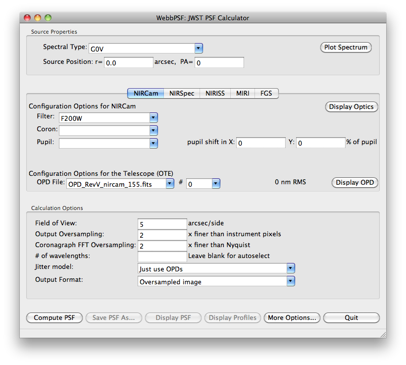

.. _gui:

========================
Graphical User Interface
========================

The WebbPSF GUI provides an easy interface to most, but not quite all, of the functionality of WebbPSF. 
(Not all of the advanced settings in the ``options`` structure for :py:class:`webbpsf.JWInstrument` are exposed in the GUI yet, and
the programming API is better suited for scripting batch calculations.)

ttk vs. wx interfaces
------------------------

Essentially identical interfaces are implemented using two different widget programming toolkits, ttk and wxwidgets. 
The optical simulation functionality is identical. The ttk interface is more likely to work by default on an arbitrary Python installation, 
since ttk is part of the standard library. However, the wx interface provides better cross-platform integration (for instance, it will
use standard Mac- or Windows-style buttons, styles, file dialog boxes, etc) and is more aesthetically pleasing. 

By default, the wx interface will attempt to load first, and if wx is not present, then it will fall back to the ttk interface.

Using the Graphical Interface
------------------------------

To start the GUI:

>>> import webbpsf
>>> webbpsf.gui()

..  You can also just run directly from the commandline the ``webbpsfgui.py`` file contained within the webbpsf module. 

**Above: wx interface on Mac OS**

.. image:: ./fig_webbpsf_gui_tk.png
   :scale: 75%
   :align: center
   :alt: WebbPSFGui main window (tk interface)

**Above: ttk interface**

The main window is divided into three regions:

* The top region allows control of the source spectral type and position. (Spectral type option requires optional install of :py:mod:`pysynphot` )
* The central, main region allows selection of instrument and configuration of instrument options. The options available here largely correspond to 
  attributes of the :py:class:`webbpsf.JWInstrument` classes.
* The lower region contains options for the PSF calculation itself such as pixel sampling and wavelengths. These correspond to parameters of the 
  :py:meth:`webbpsf.JWInstrument.calcPSF` function call.

GUI Controls
--------------

The GUI buttons invoke actions as follows:

Compute PSF
^^^^^^^^^^^^

This invokes a PSF calculation with the given options. Each wavelength will be displayed in turn as it is computed, and finally the summed broadband PSF.
This resulting PSF is stored in memory for use by the next three buttons. 

Display PSF
^^^^^^^^^^^^
This button will redisplay the PSF if the window has closed or something else has been displayed.

.. image:: ./fig_display_psf.png
   :scale: 75%
   :align: center
   :alt: PSF display

Display Profiles
^^^^^^^^^^^^^^^^
This will display the PSF's radial profile and encircled energy profile.

.. image:: ./fig_display_profiles.png
   :scale: 75%
   :align: center
   :alt: PSF radial profiles display

Save PSF As...
^^^^^^^^^^^^^^

This will invoke a standard File Save dialog box allowing you to save your new PSF. 

Display Optics
^^^^^^^^^^^^^^

This will display a graphical representation of the optical train for the current instrument configuration.

.. image:: ./fig_nircam_coron_optics.png
   :scale: 75%
   :align: center
   :alt: Sample "Display Optics" results showing NIRCam coronagraphic optics.

More Options...
^^^^^^^^^^^^^^^^^^

The 'More Options...' button on the toolbar will bring up a window that allows you to select options, either for how the PSF is computed 
(which Fourier transform algorithm is used, etc) and also for the image display stretch used for the displayed PSFs.

.. image:: ./fig_gui_more_options.png
   :scale: 75%
   :align: center
   :alt: Sample "More Options" dialog box.

--------------

Documentation last updated on |today|

