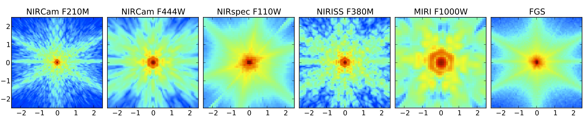

.. JWST-PSFs documentation master file, created by
   sphinx-quickstart on Mon Nov 29 15:57:01 2010.
   You can adapt this file completely to your liking, but it should at least
   contain the root `toctree` directive.

Documentation for WebbPSF 
===============================

WebbPSF is a Python package that computes simulated PSFs for the JWST instruments, taking into account detector pixel scales, rotations, filter profiles, and point source spectra. 
It is *not* a full optical model of JWST, but rather a tool for transforming optical path difference (OPD) maps, created with some other tool, into the resulting
PSFs as observed with JWST's instruments.

   Sample PSFs for JWST's instrument suite, all on the same angular scale and display stretch. 

**What this software does:**

* Uses OPD map(s) precomputed by a detailed optical simulation of JWST
* Computes from those a PSF image with requested properties for any of JWST's instruments
* Supports imaging & coronagraphy modes with all of JWST's instruments. IFUs are a work in progress.
* Provides a suite of tools for quantifying PSF properies such as FWHM, Strehl ratio, etc.

**What this software does NOT do:**

* Contain in itself any detailed thermal or optical model of JWST
* Model any of the spectrograph optics or spectroscopy modes.
* Model any detector effects such as pixel MTF, intrapixel sensitivity variations, interpixel capacitance, or any noise sources. Add those separately with your favorite detector model code.

There are three main Python modules in this distribution: a lower-level
optical propagation library (:py:mod:`POPPY <poppy>`), an implementation of the
JWST instruments using that library (:py:mod:`WebbPSF <webbpsf>`), and a graphical user interface (:py:mod:`WebbPSFgui <webbpsfgui>`).  This documentation explains the programming interface and provides usage examples for each of those three module. 

Further information from an optical modeling perspective
may be found in *``Improved PSF Simulations for JWST: Methods, Algorithms, and Validation <Improved_PSFs_for_Webb.pdf>``_*, M. D. Perrin 2011, JWST Technical report JWST-STScI-002469. 
That document describes in more detail the relevant optical physics, explains design decisions and motivation for WebbPSF's architecture, and presents
extensive validation tests demonstrating consistency between WebbPSF and other PSF simulation packages used throughout the JWST project.

The current version of WebbPSF is version 0.2.8, released Nov 7, 2011. If you would like to receive email announcements of future versions, please contact Marshall Perrin.

Contents
--------

.. toctree::
   :maxdepth: 2

   intro.rst
   installation.rst
   relnotes.rst
   webbpsf.rst
   gui.rst  
   poppy.rst
   available_opds.rst
   references.rst
   sampling.rst
   fft_optimization.rst

Indices and tables
------------------

* :ref:`genindex`
* :ref:`modindex`
* :ref:`search`

Documentation last updated on |today|

