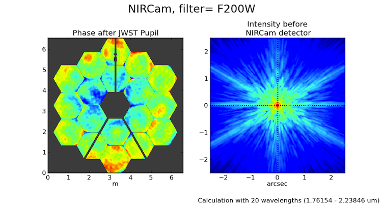
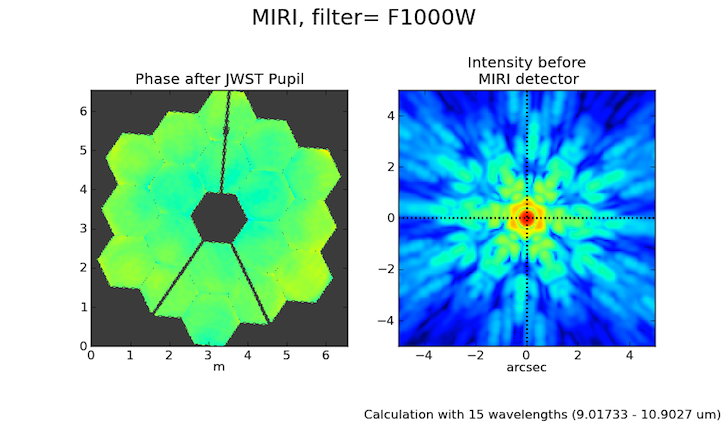

.. JWST-PSFs documentation master file, created by
   sphinx-quickstart on Mon Nov 29 15:57:01 2010.
   You can adapt this file completely to your liking, but it should at least
   contain the root `toctree` directive.

.. module:: webbpsf

=============================
The WebbPSF module
=============================

This module provides the primary interface, both for programmers and for interactive non-GUI use. It provides 
five classes corresponding to the JWST instruments, with consistent interfaces.  

Usage and Examples
-------------------

Simple PSFs are easily obtained: 

>>> from webbpsf import *
>>> nc = NIRCam()
>>> nc.filter =  'F200W'
>>> psf = nc.calcPSF(oversample=4)      # returns a pyfits.HDUlist containing PSF and header
>>> pylab.imshow(psf[0].data]           # display it on screen yourself, or
>>> display_PSF(psf)                    # use this convenient function to make a nice log plot with labeled axes
>>>
>>> psf = nc.calcPSF(filter='F470N', oversample=4)    # this is just a shortcut for setting the filter, then computing a PSF
>>>
>>> nc.calcPSF("myPSF.fits", filter='F480M' )         # you can also write the output directly to disk if you prefer.

For interactive use, you can have the PSF displayed as it is computed:

>>> nc.calcPSF(display=True)                          # will make nice plots with matplotlib.

More complicated instrumental configurations are available by setting the instrument's attributes. For instance,
one can create an instance of MIRI and configure it for coronagraphic observations, thus:

>>> miri = MIRI()
>>> miri.filter = 'F1065C'
>>> miri.image_mask = 'FQPM1065'
>>> miri.pupil_mask = 'MASKFQPM'
>>> miri.calcPSF('outfile.fits')

.. image:: ./fig_miri_coron_f1065c.png
   :scale: 75%
   :align: center
   :alt: Sample PSF image

Input Source Spectra:
^^^^^^^^^^^^^^^^^^^^^^^^^^^

WebbPSF attempts to calculate realistic weighted broadband PSFs taking into account both the source spectrum and the instrumental spectral response. 

The default source spectrum is, if :py:mod:`pysynphot` is installed, a G2V star spectrum from Castelli & Kurucz 2004. Without :py:mod:`pysynphot`, the default is a flat spectrum in :math:`F_\nu` such that the same number of photons are detected at each wavelength.

You may choose a different illuminating source spectrum by specifying a ``source`` parameter in the call to ``calcPSF()``. The following are valid sources:

1. A :py:class:`pysynphot.Spectrum` object. This is the best option, providing maximum flexibility, but requires the user to have ``pysynphot`` installed.  In this case, the ``Spectrum`` object is combined with a :py:class:`pysynphot.ObsBandpass` for the selected instrument and filter to derive the effective stimulus in detected photoelectrons versus wavelength. This is binned to the number of wavelengths set by the ``nlambda`` parameter. 
2. A dictionary with elements ``source["wavelengths"]`` and ``source["weights"]`` giving the wavelengths in meters and the relative weights for each. These should be numpy arrays or lists. In this case, the wavelengths and weights are used exactly as provided, without applying the instrumental filter profile. 

   >>> src = {'wavelengths': [2.0e-6, 2.1e-6, 2.2e-6], 'weights': [0.3, 0.5, 0.2]}
   >>> nc.calcPSF(source=src, outfile='psf_for_src.fits')

3. A tuple or list containing the numpy arrays ``(wavelength, weights)`` instead.

To calculate a monochromatic PSF, just use the ``monochromatic`` parameter. Wavelengths are always specified in meters. This is just a shorthand for a single-element ``source`` dict.

   >>> miri.calcPSF(monochromatic=9.876e-6)

Array sizes, star positions, and centering:
^^^^^^^^^^^^^^^^^^^^^^^^^^^^^^^^^^^^^^^^^^^^^^

Output array sizes may be specified either in units of arcseconds or pixels.  For instance, 

>>> mynircam = NIRCam()
>>> result = mynircam.calcPSF(fov_arcsec=7, oversample=2, filter='F250M')
>>> result2= mynircam.calcPSF(fov_pixels=512, oversample=2, filter='F250M')

By default, the PSF will be centered at the exact center of the output array. This means that if the PSF is computed on an array with an odd number of pixels, the
PSF will be centered exactly on the central pixel. If the PSF is computed on an array with even size, it will be centered on the "crosshairs" at the intersection of the central four pixels.
If one of these is particularly desirable to you, set the parity option appropriately:

>>>  instrument.options['parity'] = 'even'
>>>  instrument.options['parity'] = 'odd'

Setting one of these options will ensure that a field of view specified in arcseconds is properly rounded to either odd or even when converted from arcsec to pixels. Alternatively, 
you may also just set the desired number of pixels explicitly in the call to calcPSF():

>>>  instrument.calcPSF(fov_npixels = 512)

Offset sources:
^^^^^^^^^^^^^^^^^^^

The PSF may also be shifted off-center by adjusting the offset of the stellar source. This is done in polar coordinates:

>>> instrument.options['source_offset_r'] = 0.3         # offset in arcseconds
>>> instrument.options['source_offset_theta'] = 45.     # degrees counterclockwise from instrumental +Y in the science frame

If these options are set, the offset is applied relative to the central coordinates as defined by the output array parity.

For coronagraphic modes, the coronagraph occulter is always assumed to be at the center of the output array. Therefore, these options let you offset the source away from the coronagraph.

Pixel scales, sampling, and oversampling:
^^^^^^^^^^^^^^^^^^^^^^^^^^^^^^^^^^^^^^^^^

The derived instrument classes all known their own instrumental pixel scales. You can change the output 
pixel scale in a variety of ways, as follows. See the :py:class:`JWInstrument.calcPSF` documentation for more details.

1. set the ``oversample`` parameter to calcPSF(). This will produce a PSF with a pixel grid this many times more finely sampled. 
   ``oversample=1`` is the native detector scale, ``oversample=2`` means divide each pixel into 2x2 finer pixels, and so forth.
   You can automatically obtain both the oversampled PSF and a version rebinned down onto the detector pixel scale by setting `rebin=True` 
   in the call to calcPSF:

   >>> hdulist = instrument.calcPSF(oversample=2, rebin=True)     # hdulist will contain a primary HDU with the 
   >>>                                                            # oversampled data, plus an image extension 
   >>>                                                            # with the PSF rebinned down to regular sampling.

   

2. For coronagraphic calculations, it is possible to set different oversampling factors at different parts of the calculation. See the ``calc_oversample`` and ``detector_oversample`` parameters. This
   is of no use for regular imaging calculations (in which case ``oversample`` is a synonym for ``detector_oversample``).

   >>> miri.calcPSF(calc_oversample=8, detector_oversample= 2)    # model the occulter with very fine pixels, then save the 
   >>>                                                           # data on a coarser (but still oversampled) scale

3. Or, if you need even more flexibility, just change the ``instrument.pixelscale`` attribute to be whatever arbitrary scale you require. 

   >>> instrument.pixelscale = 0.0314159

 

The JWInstrument generic class
--------------------------------

.. inheritance-diagram:: webbpsf.NIRCam webbpsf.NIRSpec webbpsf.MIRI webbpsf.TFI webbpsf.NIRISS webbpsf.FGS

.. autoclass:: webbpsf.JWInstrument
   :members:

.. specific_instrument:

Notes on Specific Instruments
-------------------------------
NIRCam
^^^^^^

.. autoclass:: webbpsf.NIRCam

        See methods under :py:class:`JWInstrument` 
        

NIRSpec
^^^^^^^^

.. autoclass:: webbpsf.NIRSpec

        See methods under :py:class:`JWInstrument` 

MIRI
^^^^^

.. autoclass:: webbpsf.MIRI

        See methods under :py:class:`JWInstrument` 

   An example MIRI PSF in F1000W. 

   Note that the MIRI imager field of view is rotated by 4.56 degrees relative to the JWST pupil; the coronagraph optics are
   correspondingly counterrotated to align them with the pupil.  For direct imaging PSF calculations, this is most simply handled by
   rotating the pupil mask and OPD file prior to the Fourier propagation. For MIRI coronagraphy on the other hand, the rotation is performed as the 
   last step prior to the detector. 
   
   Technical aside: Note that for computational reasons having to do with accurately simulating PSF centering on an FQPM, MIRI corongraphic
   simulations will include two 'virtual optics' called 'FQPM FFT aligners' that  will show up in the display window for such calculations. These 
   can be ignored by most end users of this software; interested readers should consult the  :py:mod:`POPPY <poppy>` documentation for more detail.

NIRISS
^^^^^^^

.. autoclass:: webbpsf.NIRISS

        See methods under :py:class:`JWInstrument` 

FGS
^^^^

.. autoclass:: webbpsf.FGS

        See methods under :py:class:`JWInstrument` 

TFI
^^^^

Deprecated in favor of NIRISS.  The TFI class is still included in this version of WebbPSF for compatibility with existing code, just
to be on the safe side, but is likely to go away in the next release. 

.. autoclass:: webbpsf.TFI

Utility Functions for Display and Plotting
-------------------------------------------

.. autofunction:: webbpsf.Instrument

Display Functions
^^^^^^^^^^^^^^^^^^

.. autofunction:: display_PSF
.. autofunction:: display_PSF_difference
.. autofunction:: display_profiles

Metrics of PSF Quality
^^^^^^^^^^^^^^^^^^^^^^^

.. autofunction:: radial_profile
.. autofunction:: measure_EE
.. autofunction:: measure_fwhm
.. autofunction:: measure_sharpness
.. autofunction:: measure_centroid

--------------

Documentation last updated on |today|

